# Arrmada roadmap

_Built on 2026-10-09 from the full audit of 2026-10-08 (232 verified code findings + 10 UI walkthrough notes). 473 tasks in 20 epics, sequenced into 18 phases. Every finding is traced to a task in [the traceability table](docs/roadmap/traceability.md). Each epic has its own file in [docs/roadmap/](docs/roadmap/)._

**How to read this.** Phases are the order to ship in. Each phase lists its tasks; the full detail of a task (problem, approach, files, acceptance criteria, tests, dependencies) lives in its epic file under docs/roadmap/ — click the id. Tick the checkbox there when a task ships.

| Key | Meaning |
|---|---|
| **P0** | Broken now, data loss, or security exposure — do first |
| **P1** | High value, soon |
| **P2** | Important |
| **P3** | Nice to have |
| **S / M / L / XL** | under a day / 2–4 days / 1–2 weeks / more (one owner + an AI coding agent) |

**Totals:** P0 41 · P1 190 · P2 194 · P3 48 — roughly 1035 working days of effort in total (a rough sum of the effort sizes, not a schedule).

## Contents

1. [Vision](#vision) · [Principles](#principles) · [Decisions needed](#decisions-needed-from-you)
2. [Phases at a glance](#phases-at-a-glance) · [Dependency map](#dependency-map)
3. [Release plan](#release-plan) — the phases in detail
4. [Epics](#epics) — one file per epic with every task in full
5. [Program risks](#program-risks) · [Review notes](#review-notes)
6. [Finding → task traceability](docs/roadmap/traceability.md) · [Findings not actioned](#findings-not-actioned) · [Standing rules](#standing-rules)

## Vision

When the roadmap is done, Arrmada is one app that replaces the *arr stack, Overseerr, Tautulli, Bazarr and Audiobookshelf for the owner and their family, and it can be left to run unattended. Nothing irreversible happens by default. Every migration is snapshotted first. Every delete or replace goes to a recycle bin on the same drive, or through a confirmed dialog that defaults to keeping data. Any update can be rolled back from update.sh or the CLI.

The owner works from three places:
- a Dashboard 'Needs you' card, backed by sidebar badges and phone alerts
- one Activity hub that explains every download, every search outcome and every stuck import
- one Settings hub where every integration shows live status and every setting saves itself

Family members get a phone-native app. They can request exactly the seasons they want and follow progress. They are told 'ready' only once Plex has the title, with a Watch on Plex link. They can report a bad file, listen to audiobooks in the browser with lock-screen controls, and read on their e-readers.

Every module (Series, Movies, Books, Convert, Subtitles, Audiobooks, and Music if it is kept) records what it did and why, and can be undone. Every module also keeps the standing rules: audiobook privacy (how much and when, never what), the always-on adult filter, keys entered only in the UI, no media under /data, and the current dark, warm, terracotta look.

## Principles

- Safety before features. Snapshot before every migration. Every destructive path either goes to a recycle bin on the same drive or asks first and defaults to keeping data. When recycling fails, refuse; never fall back to a hard delete. Test destructive features (recycle, merge, Convert hold/revert, per-root bins) only on synthetic fixtures or a test share. Never test against the owner's real library, and never test-convert real files.
- The server decides who reaches what. Every new route goes into SEC-02's golden route table with an explicit role, and the route-walk test covers it. Ops routes are RoleManager and system/secret routes are RoleAdmin from day one. Every new websocket topic is staff-only unless it is user.<id>.*. No API response may carry an indexer key, tracker token or webhook URL.
- Standing rules are acceptance criteria on every task, not a separate epic. Audiobook privacy: no new log line, trace, table or support bundle pairs a user with a book. The adult filter applies on every new Discover and OPDS surface. Credentials are entered only in the app UI. Nothing may sit under /data. The existing visual style is kept unless the task is the design-system work.
- Build each shared primitive once, in the earliest phase that needs it. When two tasks overlap, the later one becomes 'adopt and verify':
- BE-01 is SAFE-14.
- FE-02 is SEC-14's 401 path.
- OBS-03's TaskStatus/tasks API is what BE-08 persists.
- ACQ-22's queue snapshot feeds BE-13 and FE-26, using one topic name.
- ACQ-15 owns search_attempts and RejectCode; MOV-04, SER-19 and MUS-09 read them.
- ACQ-18's Wanted row shape is reused by MOV-08 and MUS-18.
- ACQ-21's fold helper is shared by BOOK-06 and MUS-04.
- OBS-10 builds the Alerts page that PLEX-18 routes to and SEC-08 locks down.
- INT-15/16 build Connections, and CFG-15 folds the metadata keys into it.
- PLEX-06 and APP-04 are one sign-in fix.
- COPY-13 is FE-17.
- COPY-01's useTabParam is FE-23's hook.
- SAFE-18 extends CFG-05/06's update.sh rollback.
- CFG-12 extends APP-05's Me page rather than adding a second account page.
- CFG-16 links to PLEX-17's Plex page.
- Truth over polish. Every status word, sentence and button result is backed by recorded server state (outcome rows, attempt ledgers, health checks). The COPY-07 copy guard gains new retired phrases in each phase.
- Ship thin vertical slices straight to main. Each task can be deployed on its own with ./update.sh, comes with tests, passes go vet plus go test -race in the Docker one-liner before push, and ends with the Co-Authored-By trailer.
- State is durable and events are cheap. Side effects that must happen (reindex, request-ready, Plex partial scan, catalogue refresh) go through BE-06's outbox or a direct call, never a lossy bus message. Websocket and bus events are id-only nudges that make the UI refetch.
- Migrations take the next free number at commit time (0090 onward is shared by every epic), are additive by default, and rebuild tables only through BE-01's runner (foreign keys off, then foreign_key_check).
- Soft dependencies never block. Use the documented fallback (a local component, a direct hook, a handleSystemHealth warning), then switch to the primitive when it lands. Hard dependencies are enforced by the order of the phases.
- Close each phase only when its exit criteria are checked on the owner's real Unraid server (read-only checks) and on a real iPhone and Android phone. Then do a short re-plan; this is mandatory after Phase 5 and before starting any module rebuild.

## Decisions needed from you

- [ ] Music (MUS-03, end of Phase 1). Options: Rebuild it as a Lidarr-lite (Phase 15), Park it (off, labelled Preview, no further work), or Cut it (MUS-25 in Phase 2; data stays, can be restored from git). Recommendation: Park, unless the soak shows the family actually uses it.
- [ ] Usenet. Either officially torrent-only, meaning INT-12 stops advertising and querying Newznab and MOV-11 never recommends usenet, or plan a usenet client later. Recommendation: torrent-only.
- [ ] ARRMADA_BASE_URL. Either remove it in Phase 2 (CFG-08), or make reverse-proxy sub-paths work end to end (FE-29 in Phase 16). Recommendation: remove it. The router migration and push URLs are simpler without a basename.
- [ ] Stall fail-over defaults (ACQ-06): confirm on by default, a 6-hour no-progress threshold and at most 3 replacements per check, or pick other numbers.
- [ ] Recycle-bin placement (SAFE-17). Confirm a hidden .arrmada-recycle folder on each library root, and say whether the libraries are Unraid user shares (/mnt/user) or disk shares. This changes whether 'always a rename' is achievable.
- [ ] Convert originals hold (CONV-08/09): the retention window (days) and the space budget that pauses conversions.
- [ ] Convert encode choices:
- the default Dolby Vision policy (leave DV files alone, or convert and drop DV, until CONV-29 can keep profile 8.1)
- whether 10-bit output for 8-bit sources is allowed
- whether resumable encoding becomes the default once it is verified
- [ ] Request policy:
- new Plex sign-ins auto-approve movies only (REQ-09)
- whether per-user quotas are switched on, and their limits (REQ-14)
- whether requesters can report problems (REQ-22)
- [ ] Plex sign-in for the owner and staff (PLEX-15). Either allow Plex sign-in that resolves to a linked local admin or manager account, or require local passwords for staff. Also whether to merge existing duplicate Plex requester accounts.
- [ ] Audiobook client ids (AUD-14). If iOS verification shows a client needs UUID-shaped ids, may devices that sign in afterwards get UUID ids? Lissen devices keep theirs.
- [ ] TorrentLeech RSS key (INT-20). Either store TorrentLeech's RSS key (a secret) server-side to enable RSS, or skip TorrentLeech RSS and rely on scheduled searches.
- [ ] Quality behaviour:
- turn the Unwanted pack on by default for every profile (QUAL-20)
- after reviewing the shadow-mode disagreements, approve flipping ranking v2 to the default (QUAL-23)
- whether TRaSH custom-format import is wanted at all (QUAL-27)
- [ ] Distribution (CFG-28/29). Whether to publish the image to GHCR, public or private, so update.sh pulls a tag instead of compiling, and whether to maintain an Unraid Community Apps template.
- [ ] Security trade-offs needing explicit sign-off:
- relax COOP to same-origin-allow-popups so Plex sign-in works in the installed PWA (APP-04)
- expose a token-authenticated iCal feed off the LAN (APP-18)
- [ ] Outgoing email (BOOK-23/24). Whether to add SMTP for Send to Kindle, which other alerts may then reuse, and which provider. Credentials are entered in the app.
- [ ] Where Alerts lives: as its own top-level page (OBS-10/PLEX-18), or as a section of the Settings hub once CFG-13 exists. Decide before Phase 6 so it isn't moved twice.

## Phases at a glance

| Phase | Theme | Tasks | P0 | P1 | Effort (days, rough) | Estimate |
|---|---|---|---|---|---|---|
| [Phase 0 — Stop the bleeding](#phase-0--stop-the-bleeding) | Small P0 fixes for data loss, security/privacy leaks and silent failures | 29 | 26 | 3 | 49 | 3–4 weeks (19 S, 9 M ≈ 17–21 working days) |
| [Phase 1 — Finish the P0s and add the safety net](#phase-1--finish-the-p0s-and-add-the-safety-net) | The remaining P0 correctness work, plus the P1 rails every later phase relies on | 30 | 15 | 14 | 62 | 4–5 weeks (10 S, 16 M ≈ 20–25 working days) |
| [Phase 2 — Safe to operate](#phase-2--safe-to-operate) | Backups, restore and rollback; admin-only boundaries; validated folders; fail-safe settings; nothing visibly broken; truthful copy | 42 | 0 | 29 | 54 | 4–5 weeks (37 S, 6 M ≈ 21–26 working days) |
| [Phase 3 — Shared building blocks](#phase-3--shared-building-blocks) | Foundations that unblock the overhauls: UI kit, data router, data hook, test harness, nav, Settings shell, job runner, outbox, scheduler tasks, health registry, per-root recycle bins, live folder roots | 29 | 0 | 7 | 67 | 4.5–5.5 weeks (10 S, 18 M ≈ 22–27 working days) |
| [Phase 4 — Acquisition you can trust](#phase-4--acquisition-you-can-trust) | Integration health, the grab lifecycle, Review/Block/Blocklist, quality that honours the profile on TV, no surprise re-downloads, series metadata and monitoring, book RSS | 35 | 0 | 30 | 69 | 5–6 weeks (18 S, 17 M ≈ 24–30 working days) |
| [Phase 5 — Why isn't it downloading?](#phase-5--why-isnt-it-downloading) | Search outcomes and a Wanted view for every media type, identity by info hash, an honest Movies module, the right show under every name | 35 | 0 | 20 | 73 | 5–6 weeks (16 S, 18 M ≈ 24–30 working days) |
| [Phase 6 — Requests 2.0 and Needs you](#phase-6--requests-20-and-needs-you) | A real requests product for staff and requesters, the attention feed, and alerts that reach the owner | 28 | 0 | 20 | 68 | 5–6 weeks (10 S, 17 M, 1 L ≈ 23–29 working days) |
| [Phase 7 — Plex loop, accounts and the requester phone app](#phase-7--plex-loop-accounts-and-the-requester-phone-app) | Insights numbers you can trust, partial scans after every change, Plex sign-in that works on iPhone, Watch on Plex, and a phone-native requester shell | 30 | 0 | 15 | 60 | 4.5–5.5 weeks (15 S, 16 M ≈ 22–28 working days) |
| [Phase 8 — Family payoff: listen in Arrmada and a deeper Discover](#phase-8--family-payoff-listen-in-arrmada-and-a-deeper-discover) | Arrmada's own listening API and web player, a verified iPhone audiobook app, Discover browse/person/collection pages, and the phone calendar | 21 | 0 | 7 | 61 | 4–5 weeks (5 S, 14 M, 2 L ≈ 21–26 working days) |
| [Phase 9 — One place for everything: Activity, Settings and Connections hubs, live UI](#phase-9--one-place-for-everything-activity-settings-and-connections-hubs-live-ui) | The Activity hub, the Settings hub sections, the Connections hub, and websocket-driven pages | 27 | 0 | 3 | 65 | 4.5–6 weeks (8 S, 20 M ≈ 23–29 working days) |
| [Phase 10 — Series and Movies rebuilt](#phase-10--series-and-movies-rebuilt) | Plex-like series page, movie versions and editions, safe rename and organize, the mass editor, better import and matching | 26 | 0 | 7 | 74 | 4.5–6 weeks (5 S, 21 M ≈ 23–29 working days) |
| [Phase 11 — Convert rebuilt](#phase-11--convert-rebuilt) | A durable ledger, an originals hold with Revert, plan-first confirmation, a stricter quality gate, events, forecasts, device awareness and resumable encodes | 19 | 0 | 9 | 51 | 4–5 weeks (9 S, 11 M, 2 L ≈ 20–24 working days) |
| [Phase 12 — Subtitles rebuilt](#phase-12--subtitles-rebuilt) | Provenance and attempt ledgers, honest provider status, scored and sync-checked downloads, a persistent two-lane queue, per-file control, language profiles, and fixing problems that family members report | 29 | 0 | 16 | 63 | 4.5–5.5 weeks (12 S, 17 M ≈ 22–27 working days) |
| [Phase 13 — Books and the audiobook library rebuilt](#phase-13--books-and-the-audiobook-library-rebuilt) | Lossless merges, editions and languages, release dates, authors, OPDS and Send to Kindle, admin screens that fit, and audiobook library polish | 21 | 0 | 3 | 49 | 3.5–4 weeks (7 S, 14 M ≈ 17–21 working days) |
| [Phase 14 — Smarter grabbing: Quality v2 and power tools](#phase-14--smarter-grabbing-quality-v2-and-power-tools) | Explainable profiles, the Unwanted pack, ordered-key ranking v2 behind shadow mode, the custom-format engine, more series coverage, and indexer and path power tools | 18 | 0 | 0 | 48 | 3–4 weeks of work (3 S, 15 M ≈ 16–20 working days), plus at least 2 weeks of ranking v2 in shadow mode before QUAL-23 |
| [Phase 15 — Music: Lidarr-lite (only if MUS-03 chose Rebuild)](#phase-15--music-lidarr-lite-only-if-mus-03-chose-rebuild) | Correct matching and importing, honest outcomes, graduation from Preview, staying current, owner tools, and artwork | 21 | 0 | 7 | 49 | 3.5–4 weeks (9 S, 11 M, 1 L ≈ 17–21 working days) plus a 7-day soak; zero if MUS-03 chose Park or Cut |
| [Phase 16 — First run, releases, logs and a consistent UI](#phase-16--first-run-releases-logs-and-a-consistent-ui) | A guided first run, published images and 'update available', support-grade logs, and frontend consolidation | 19 | 0 | 0 | 39 | 3–4 weeks (9 S, 10 M, 1 L ≈ 16–20 working days) |
| [Phase 17 — Backlog: Insights depth, alert extras and engine extras](#phase-17--backlog-insights-depth-alert-extras-and-engine-extras) | Tautulli-depth Insights, a personal calendar feed, alert refinements, and the remaining Convert and Subtitles big bets | 14 | 0 | 0 | 34 | 2.5–3 weeks (6 S, 7 M, 1 L ≈ 12–15 working days) |

## Dependency map

```mermaid
flowchart LR
  BE1["BE M1 Safety rails"] --> SAFE1["SAFE M1 Nothing irreversible"]
  SAFE1 --> SAFE2["SAFE M2 Honest undoable deletes"]
  SAFE1 --> SAFE3["SAFE M3 Backups and restore"]
  SAFE2 --> SAFE4["SAFE M4 Per-root recycle bins"]
  CFG1["CFG M1 Settings save, folders checked"] --> SAFE4
  SAFE4 --> CFG5["CFG M5 Folders apply live"]
  CFG1 --> CFG5
  SAFE3 --> CFG2["CFG M2 Deploys you can undo"]
  SAFE3 --> SAFE5["SAFE M5 Update rollback"]
  CFG2 --> SAFE5
  SEC3["SEC M3 Adult filter, never /data"] --> CFG1
  CFG1 --> ACQ2
  CFG1 --> MUS1["MUS M1 Contain"]
  CFG1 --> CFG4a["CFG M4 hub shell"]
  SEC1["SEC M1 Deny-by-default routes and topics"] --> SEC4["SEC M4 Secrets server-side, admin-only"]
  SEC1 --> SEC5["SEC M5 Hardened edges"]
  SEC1 --> REQ1
  SEC1 --> FE6
  SEC1 --> ACQ6
  SEC1 --> AUD2
  SEC2["SEC M2 Audiobook log privacy"] --> AUD3
  SEC2 --> CFG7
  SEC3 --> BOOK5
  FE1["FE M1 Nothing visibly broken"] --> SEC6["SEC M6 Sessions"]
  FE1 --> FE2["FE M2 Route split"]
  FE2 --> FE5["FE M5 Data router, URL state"]
  FE3["FE M3 Kit and test harness"] --> FE4["FE M4 Nav and layout"]
  FE3 --> FE5
  FE5 --> FE6["FE M6 Live instead of polling"]
  FE6 --> FE7["FE M7 Consolidation"]
  BE1 --> BE3["BE M3 Outbox, pinned deletes"]
  BE2["BE M2 Fail-safe data"] --> BE3
  SAFE2 --> BE3
  BE1 --> BE4["BE M4 Job runner and tasks"]
  ACQ1["ACQ M1 Nothing silently lost"] --> ACQ2["ACQ M2 Dead downloads replaced"]
  ACQ2 --> ACQ3["ACQ M3 Review, Block, Blocklist"]
  SAFE2 --> ACQ3
  ACQ3 --> ACQ4["ACQ M4 Search outcomes and Wanted"]
  ACQ4 --> ACQ5["ACQ M5 Identity by info hash"]
  ACQ5 --> ACQ6["ACQ M6-M7 Activity hub"]
  ACQ3 --> SEC4
  SER1["SER M1 Safe buttons and renames"] --> ACQ2
  SER1 --> ACQ4
  INT1["INT M1 See what is broken"] --> ACQ4
  BOOK1["BOOK M1 Stop losing books"] --> ACQ4
  MUS1 --> ACQ4
  ACQ5 --> BE5["BE M5 Live queue and request events"]
  BE5 --> FE6
  OBS1["OBS M1 Truthful health"] --> OBS2["OBS M2 Health registry and tasks"]
  BE1 --> OBS2
  OBS2 --> OBS3["OBS M3 Needs you"]
  OBS3 --> OBS4["OBS M4 Alerts"]
  OBS4 --> SEC4
  OBS2 --> OBS5["OBS M5 Integration health"]
  INT1 --> OBS5
  SAFE3 --> OBS5
  OBS4 --> OBS6["OBS M6 Alert polish"]
  BE4 --> OBS6
  OBS3 --> FE6
  OBS3 --> ACQ6
  INT1 --> INT2["INT M2 Stop self-sabotage"]
  INT2 --> INT3["INT M3 Connections hub"]
  CFG4a --> INT3
  INT3 --> CFG4b["CFG M4 hub sections"]
  INT3 --> INT4["INT M4 Prowlarr and tracker autopilot"]
  SEC4 --> INT4
  INT2 --> INT5["INT M5 ID-based searches"]
  QUAL1["QUAL M1 No permissive fallback"] --> QUAL2["QUAL M2-M3 TV bitrate, no surprise upgrades"]
  QUAL2 --> QUAL3["QUAL M4 Honest why"]
  QUAL3 --> QUAL4["QUAL M5-M7 Unwanted pack, ranking v2, formats"]
  QUAL2 --> SER5["SER M6 Specials and pack upgrades"]
  QUAL2 --> CONV3["CONV M3-M4 Plan first, stricter gate"]
  SER1 --> SER2["SER M2 Data and monitoring"]
  SER2 --> SER3["SER M3 Right show under every name"]
  SER3 --> SER4["SER M4-M5 Plex-like page"]
  ACQ4 --> SER4
  FE3 --> SER4
  SER4 --> SER5
  MOV1["MOV M1 Quiet sweeps"] --> MOV2["MOV M2-M3 Honest page, Wanted, queue"]
  ACQ4 --> MOV2
  BE4 --> MOV2
  MOV2 --> MOV3["MOV M4 Versions and editions"]
  MOV3 --> MOV4["MOV M5-M6 Rename, organize, mass edit"]
  SAFE2 --> MOV4
  INT5 --> MOV4
  REQ1["REQ M1 Requests page and staff alerts"] --> REQ2["REQ M2 Decisions with context"]
  FE3 --> REQ1
  BOOK1 --> REQ1
  REQ1 --> OBS3
  REQ2 --> REQ3["REQ M3 Seasons and quotas"]
  SER2 --> REQ3
  INT2 --> REQ3
  REQ3 --> REQ4["REQ M4 Ready means in Plex"]
  PLEX2["PLEX M2 Partial scans"] --> REQ4
  PLEX4["PLEX M4 Watch on Plex"] --> REQ4
  FE6 --> REQ4
  BE3 --> PLEX2
  PLEX1["PLEX M1 Numbers you trust"] --> PLEX5["PLEX M5 One Plex page, linked accounts"]
  PLEX3["PLEX M3 Sign-in and status"] --> PLEX4
  PLEX2 --> PLEX4
  MOV3 --> PLEX4
  BE4 --> PLEX5
  CFG4a --> PLEX5
  PLEX5 --> PLEX6["PLEX M6 Insights navigation"]
  OBS4 --> PLEX6
  PLEX6 --> CFG4b
  PLEX3 --> CFG4b
  APP1["APP M1 Safe on a phone"] --> APP2["APP M2 Phone shell and Me page"]
  REQ1 --> APP2
  FE3 --> APP2
  APP2 --> APP3["APP M3 Title URLs and deep links"]
  FE5 --> APP3
  APP3 --> REQ5["REQ M5 Discover depth"]
  REQ4 --> REQ5
  APP2 --> CFG3["CFG M3 Accounts"]
  CFG3 --> SEC6
  AUD1["AUD M1 Places safe"] --> AUD2["AUD M2 Web-player API"]
  AUD2 --> AUD3["AUD M3-M4 Verified iPhone app"]
  AUD2 --> APP4["APP M4 Listen in Arrmada"]
  AUD3 --> APP4
  APP2 --> APP4
  APP4 --> APP5["APP M5-M7 Notify, calendar, My shelf"]
  CFG4b --> CFG6["CFG M6 Guided first run"]
  INT2 --> CFG6
  SAFE3 --> CFG7["CFG M7 Status, releases, logs"]
  CFG2 --> CFG7
  SEC4 --> CFG7
  CONV1["CONV M1 Stop the damage"] --> CONV2["CONV M2 Ledger, hold, revert"]
  SAFE4 --> CONV2
  CONV2 --> CONV3
  FE3 --> CONV3
  CONV3 --> CONV4["CONV M5-M7 Events, devices, resumable"]
  OBS4 --> CONV4
  MOV3 --> CONV4
  PLEX3 --> CONV4
  CONV4 --> OBS6
  COPY1["COPY M1 Nothing tells you wrong"] --> CONV1
  COPY1 --> COPY2["COPY M2-M3 Real setup, one vocabulary"]
  SUB1["SUB M1 AI fallthrough, true coverage"] --> SUB2["SUB M2-M3 Ledger, backoff, honest status"]
  SAFE2 --> SUB1
  SUB2 --> SUB3["SUB M4-M7 Sync, queue, drawer, profiles"]
  COPY1 --> SUB3
  PLEX2 --> SUB3
  CONV3 --> SUB3
  SUB2 --> REQ6["REQ M6 Report a problem"]
  REQ1 --> REQ6
  BOOK1 --> BOOK2["BOOK M2 Wanted books arrive"]
  BOOK1 --> BOOK4["BOOK M4 Read, Listen, Both"]
  BOOK2 --> BOOK3["BOOK M3 Lossless merges"]
  AUD1 --> BOOK3
  BOOK3 --> BOOK5["BOOK M5-M9 Editions, authors, OPDS, Kindle"]
  OBS4 --> BOOK5
  BOOK5 --> AUD4["AUD M5 Library polish"]
  AUD3 --> AUD4
  BOOK5 --> APP5
  MUS1 --> MUS2["MUS M2 Decide"]
  MUS2 --> MUS3["MUS M3-M7 Rebuild"]
  MUS2 --> MUS4["MUS Cut path"]
  ACQ4 --> MUS3
  SAFE4 --> MUS3
```

## Release plan

### Phase 0 — Stop the bleeding

> **Status: shipped 2026-10-09** — all 29 tasks merged to main (each lane implemented, adversarially reviewed and fixed; full race suite green).

**Theme:** Small P0 fixes for data loss, security/privacy leaks and silent failures  
**Goal:** Nothing a person or a background job does can silently destroy files, rows or listening privacy. Requesters can reach only their own surface. Settings save again. The worst silent acquisition losses stop. BE-01 and SAFE-14 land as one migration-runner change, with SAFE-01's snapshot running in its BeforeMigrate hook.  
**Why now:** These are live data-loss, privacy and security defects on a server the family uses every day. Every later phase ships migrations and destructive paths, so two things must exist first: the snapshot-before-migrate and the confirm/bin primitives. Without the Settings save fix, ACQ-06, SAFE-08 and MUS-01 can't be configured at all.  
**Estimate:** 3–4 weeks (19 S, 9 M ≈ 17–21 working days)

**Exit criteria**

- ./update.sh with a pending migration leaves a pre-migrate VACUUM INTO snapshot beside the DB. A store test runs a parent-table rebuild migration and shows child rows survive with PRAGMA foreign_key_check clean.
- Every Settings tab saves: a GET-then-PUT round-trip test passes and the UI shows a field-named 400 for unknown keys.
- A route-walk test over every route registered in internal/httpapi/server.go matches the golden table: a requester gets 403 on every staff API. On the owner's phone, a requester can still use Discover, Calendar, My Books, Audiobooks, the bell and Lissen. A requester websocket receives only its own events and the heartbeat.
- Grepping the live log and the scrubbed old log files for a test audiobook's title, author or item id returns nothing. The manual-import listing is staff-only and confined to library and download roots.
- Delete user, remove download, delete series and audiobook merge each open the shared ConfirmDialog, which defaults to keeping data and states what happens. Files go to the bin or a 14-day backup. The bin's size cap never purges an item recycled in the same operation (test). Convert refuses a file whose original the cap would purge.
- Boot and the merge-all endpoint no longer merge or delete books. No grab happens under the hidden permissive profile fallback and cams stay rejected. AV1/HEVC-converted files read back as their real codec and are not upgrade candidates.
- Series quick Grab and Replace only import inside the grab's recorded scope. Rename always shows a preview and refuses to overwrite an existing file (test).
- Music is off on a fresh install and labelled Preview, and switching it off stops its jobs and API. Incomplete albums back off 30 min → 12 h → weekly, with at most 25 albums per sweep (logged).
- Book and music reviews import into the picked item and never a movie id. When every indexer errors, no search miss is recorded. Resume can't override the disk guard, and Downloads shows what the guard is holding.
- At 375 px no requester page scrolls sideways (DevTools check), and no invisible tap target can file, approve or decline a request on touch.

| Task | Title | Epic | Priority | Effort |
|---|---|---|---|---|
| [BE-01](docs/roadmap/BE.md#be-01) | Migration runner: safe parent-table rebuilds (FKs off outside the tx + foreign_key_check), lint test, pre-migrate hook for SAFE's snapshot | BE | P1 | S |
| [SAFE-01](docs/roadmap/SAFE.md#safe-01) | Snapshot the database automatically before pending migrations run | SAFE | P0 | M |
| [SAFE-14](docs/roadmap/SAFE.md#safe-14) | Rebuild-safe migrations: run table-rebuild migrations with foreign keys off and a foreign_key_check | SAFE | P1 | S |
| [CFG-01](docs/roadmap/CFG.md#cfg-01) | Fix 'Save settings': drop read-only fields from GET /settings, send only changed keys, name unknown fields in 400s | CFG | P0 | S |
| [SEC-04](docs/roadmap/SEC.md#sec-04) | Audiobook privacy: request logs carry route patterns and query keys only, plus a one-time scrub of old log files | SEC | P0 | S |
| [SEC-01](docs/roadmap/SEC.md#sec-01) | Manual-import listing: staff only, confined to library/download roots, never /data | SEC | P0 | S |
| [SEC-03](docs/roadmap/SEC.md#sec-03) | Websocket topic policy: non-staff receive only their own events and the heartbeat | SEC | P0 | S |
| [SEC-02](docs/roadmap/SEC.md#sec-02) | Deny-by-default route scopes with one requester allowlist, a golden route table and a route-walk test | SEC | P0 | M |
| [SAFE-02](docs/roadmap/SAFE.md#safe-02) | Shared destructive-action dialog and a cheap 'where do deleted files go' endpoint | SAFE | P0 | S |
| [SAFE-03](docs/roadmap/SAFE.md#safe-03) | User delete asks first, states what will be lost (counts only), and snapshots the DB beforehand | SAFE | P0 | S |
| [SAFE-04](docs/roadmap/SAFE.md#safe-04) | Removing a download asks what to do with the files, can't wipe the whole client, and closes out the grab | SAFE | P0 | M |
| [SAFE-05](docs/roadmap/SAFE.md#safe-05) | Whole-series delete goes to the recycle bin with its subtitles, refuses on bin failure, and doesn't delete files by default | SAFE | P0 | M |
| [SAFE-06](docs/roadmap/SAFE.md#safe-06) | Audiobook merge never hard-deletes sources: temp output, duration check, sources to the bin or a 14-day backup, tags kept | SAFE | P0 | M |
| [SAFE-08](docs/roadmap/SAFE.md#safe-08) | The size cap never purges what was just deleted; bin rows show when they go for good | SAFE | P1 | S |
| [CONV-02](docs/roadmap/CONV.md#conv-02) | Interim guard: never convert a file whose original the recycle-bin cap would purge | CONV | P0 | S |
| [CONV-01](docs/roadmap/CONV.md#conv-01) | Back off after transient failures and check scratch/library space before any heavy work | CONV | P0 | M |
| [BOOK-01](docs/roadmap/BOOK.md#book-01) | Turn off every automatic book merge (boot, the merge-all endpoint, the Hardcover upgrade fold) | BOOK | P0 | S |
| [QUAL-01](docs/roadmap/QUAL.md#qual-01) | One profile resolver: every acquisition path resolves a missing profile to the default, and the fallback never grabs cams | QUAL | P0 | S |
| [QUAL-03](docs/roadmap/QUAL.md#qual-03) | AV1/HEVC conversions read back as their real codec: restamp the codec token in place, repair existing rows, and never re-grab the release a file was converted from | QUAL | P0 | S |
| [SER-04](docs/roadmap/SER.md#ser-04) | Renames can never overwrite a file, and Rename shows its preview before moving anything | SER | P0 | M |
| [SER-01](docs/roadmap/SER.md#ser-01) | Quick Grab and Replace stop bypassing the import gate: record each grab's scope and force only inside it | SER | P0 | M |
| [MUS-01](docs/roadmap/MUS.md#mus-01) | Music off by default and labelled Preview; switching it off stops its jobs, actions and API | MUS | P0 | S |
| [MUS-02](docs/roadmap/MUS.md#mus-02) | Per-album search backoff, 25-album cap per sweep, and no searches for albums with no listing or not yet released | MUS | P0 | M |
| [ACQ-01](docs/roadmap/ACQ.md#acq-01) | Review: 'Import into a different…' and 'Import anyway' work for book and music reviews | ACQ | P0 | S |
| [ACQ-02](docs/roadmap/ACQ.md#acq-02) | An indexer outage is never recorded as a search miss | ACQ | P0 | S |
| [ACQ-03](docs/roadmap/ACQ.md#acq-03) | Disk guard: a manual Resume can't defeat it, and Downloads shows what it is holding | ACQ | P0 | S |
| [APP-01](docs/roadmap/APP.md#app-01) | No invisible tap targets on touch: Discover/Books quick-request and request-strip Approve/Decline | APP | P0 | S |
| [APP-02](docs/roadmap/APP.md#app-02) | No sideways scroll at 375px: requester header stopgap and a Discover toolbar that fits a phone | APP | P0 | S |
| [SER-05](docs/roadmap/SER.md#ser-05) | Pin the numbering source per series; scheduled, import-time and fallback refreshes never renumber or move files | SER | P0 | M |

### Phase 1 — Finish the P0s and add the safety net

> **Status: shipped 2026-10-09** — 29 of 30 tasks merged to main (full race suite, lint and frontend tests green). MUS-03 (the Music decision) waits for its 3-week usage soak.

**Theme:** The remaining P0 correctness work, plus the P1 rails every later phase relies on  
**Goal:** Close the rest of the P0s: series grab planner and numbering, book identity, subtitle source ladder and coverage, and safe stall fail-over. Add the P1 rails that protect files and listening places:
- no hard-delete fallback anywhere
- deleting a movie cancels its download
- panic-safe background work
- synchronous movie attach
- zero-disk sweeps
- Audiobookshelf places that can't be dragged back

Record the Music decision after a soak of 3+ weeks.  
**Why now:** These are the rest of the P0s, plus the rails everything else assumes:
- SAFE-07's refuse-don't-hard-delete is what SUB-04, BE-12, per-root bins and Convert's hold rely on.
- BE-02/BE-03 must come before the job runner and the outbox.
- GrabForScope (SER-02) must exist before ACQ-08 and the search-outcome work rebase onto it.
- BOOK-03's book_id is what Requests 2.0 keys on.
- AUD-03 must land before BOOK-10 re-keys listening ids.
Phase 0 started the soak that the Music decision needs.  
**Estimate:** 4–5 weeks (10 S, 16 M ≈ 20–25 working days)

**Exit criteria**

- With recycling forced to fail in tests, the movies, series, convert-retire and replace paths refuse. Movies.Delete aborts before touching rows. Movie and book delete dialogs default 'delete files' off and say where files go.
- Deleting a movie cancels its in-flight download. A completed download for a deleted movie appears in Review as held and is never imported by name. The grab gets the removed/cancelled/orphaned status that ACQ-09 will adopt.
- A panic injected into a scheduler task and into a background loop is logged with a stack trace, and the process keeps serving (test). HTTP-started goroutines stop on shutdown.
- A movie import attaches even when its bus event is dropped or the app is killed mid-import (attach_state test), so no movie sticks at Wanted.
- Grab missing, episode Grab, Replace and Specials all go through GrabForScope. Season 0 is its own scope matched only by S00Exx. Scheduled, import-time and fallback refreshes never renumber or move files, because the numbering source is pinned per series.
- 'Thrawn' and 'Thrawn: Alliances' exist as separate books. Every existing book request has a book_id, shows Available and sent 'ready'. Wanted books stay on the search ladder instead of being dropped after two misses.
- With OpenSubtitles configured, a file with no match, a provider error or a spent quota gets an AI subtitle in the same job. Imports and manual jobs run ahead of the sweep. Forced tracks are never extracted or counted as the full subtitle, and .en.hi.srt counts as English. Sidecars move or recycle with their video. Movie coverage counts only sidecars paired by base name. Convert keeps forced subtitles under the default settings.
- Deleting a quality profile asks for a target profile and reassigns titles in one transaction, and boot repairs dangling profile references.
- Stall fail-over is on by default after 6 h. It replaces before it removes, never removes the only copy, acts on at most 3 per check and logs what it did. Downloads keeps qBittorrent's raw state and swarm counts.
- Search-missing, RSS, upgrade and stall sweeps run with zero ffprobe calls and zero library stat calls per cycle (counter test).
- An empty Audiobookshelf close or sync never moves a place. Listen Again starts from 0. App PATCHes go through the sync guards. Lissen is verified against the live server.
- MUS-03 records a dated Rebuild / Park / Cut decision with the indexer-load and usage evidence, and every later MUS task is marked go or won't-do.

| Task | Title | Epic | Priority | Effort |
|---|---|---|---|---|
| [SAFE-07](docs/roadmap/SAFE.md#safe-07) | Never fall back to hard delete: every delete and replace path refuses when the bin fails, and Movies.Delete aborts before touching rows | SAFE | P1 | M |
| [SAFE-09](docs/roadmap/SAFE.md#safe-09) | Movie and book destructive actions: confirm version deletes, 'delete files' off by default, copy that says where files go | SAFE | P1 | S |
| [SAFE-10](docs/roadmap/SAFE.md#safe-10) | Deleting a movie cancels its downloads, and a download for a deleted movie is held for review, never imported by name | SAFE | P1 | M |
| [BE-02](docs/roadmap/BE.md#be-02) | Panic safety net: internal/safego, a run group for every background loop, panic-safe scheduler, and HTTP goroutines tied to runCtx | BE | P1 | M |
| [BE-03](docs/roadmap/BE.md#be-03) | Movie imports attach synchronously with a durable attach_state; file deletions forget their import synchronously | BE | P1 | M |
| [SUB-02](docs/roadmap/SUB.md#sub-02) | Import and manual jobs jump ahead of the sweep (in-memory queue priority) | SUB | P0 | S |
| [SUB-01](docs/roadmap/SUB.md#sub-01) | Per-language source ladder: fall through extract → OpenSubtitles → AI | SUB | P0 | M |
| [SUB-03](docs/roadmap/SUB.md#sub-03) | Forced and SDH are variants: detect them, extract the full track, count coverage correctly | SUB | P0 | M |
| [SUB-04](docs/roadmap/SUB.md#sub-04) | Sidecars travel with their video on movie/episode upgrade and delete | SUB | P0 | S |
| [SUB-05](docs/roadmap/SUB.md#sub-05) | Movie coverage pairs sidecars by base name; unpaired ones are orphans, not coverage | SUB | P0 | M |
| [CONV-04](docs/roadmap/CONV.md#conv-04) | Never drop forced subtitles; don't treat forced-only sidecars as full coverage | CONV | P1 | S |
| [SER-02](docs/roadmap/SER.md#ser-02) | One scope-aware grab planner behind Grab missing, episode Grab and Replace (GrabForScope) | SER | P0 | M |
| [SER-03](docs/roadmap/SER.md#ser-03) | Specials (season 0) become a real scope: explicit whole-show sentinel, S00Exx-only matching, no season-level Grab | SER | P0 | S |
| [QUAL-02](docs/roadmap/QUAL.md#qual-02) | Deleting a quality profile reassigns its titles in one transaction; dangling refs are repaired at boot; the delete UI picks the target | QUAL | P0 | M |
| [BOOK-02](docs/roadmap/BOOK.md#book-02) | Full-title book identity: IdentityOf / SameBook / IdentityIndex replace the truncating titleKey everywhere | BOOK | P0 | M |
| [BOOK-03](docs/roadmap/BOOK.md#book-03) | Link book requests to the library by book_id, and backfill existing requests | BOOK | P0 | M |
| [BOOK-04](docs/roadmap/BOOK.md#book-04) | Never give up on a wanted book: a slow search ladder with a per-sweep cap | BOOK | P0 | S |
| [ACQ-04](docs/roadmap/ACQ.md#acq-04) | Keep qBittorrent's raw state, swarm counts and last activity; add Item.Phase() | ACQ | P0 | S |
| [ACQ-05](docs/roadmap/ACQ.md#acq-05) | Stall fail-over replaces before it removes: never delete the only copy, cap per tick, say what happened | ACQ | P0 | M |
| [ACQ-06](docs/roadmap/ACQ.md#acq-06) | Stall fail-over on by default: 6h global default, profile override, existing grabs covered, queue- and guard-aware clock | ACQ | P0 | M |
| [MOV-01](docs/roadmap/MOV.md#mov-01) | Periodic movie jobs read only the database: DB-only track rows and SQL search targets | MOV | P0 | M |
| [AUD-01](docs/roadmap/AUD.md#aud-01) | A session close or sync with no position never moves anyone's place | AUD | P1 | S |
| [AUD-02](docs/roadmap/AUD.md#aud-02) | Replaying a finished audiobook starts from the beginning (Listen Again works) | AUD | P1 | S |
| [AUD-03](docs/roadmap/AUD.md#aud-03) | Progress PATCHes from apps go through the sync guards instead of always winning | AUD | P1 | M |
| [MUS-03](docs/roadmap/MUS.md#mus-03) | Decide: rebuild Music as a Lidarr-lite, park it, or cut it | MUS | P1 | S |
| [SAFE-11](docs/roadmap/SAFE.md#safe-11) | Nightly and manual database backups with retention, and a health warning when they stop | SAFE | P1 | S |
| [FE-08](docs/roadmap/FE.md#fe-08) | Frontend lint and unit tests: eslint 9 (react-hooks, jsx-a11y) and vitest, running in CI | FE | P1 | S |
| [CONV-06](docs/roadmap/CONV.md#conv-06) | Persist a convert_history ledger of every conversion outcome | CONV | P1 | M |
| [CONV-17](docs/roadmap/CONV.md#conv-17) | Stricter SSIM gate: independent windows, per-window floor, fail closed | CONV | P1 | S |
| [CONV-16](docs/roadmap/CONV.md#conv-16) | Black-bar crop: off by default, dense sampling, never crop films that change shape | CONV | P2 | S |

### Phase 2 — Safe to operate

> **Status: shipped 2026-10-09** — 41 of 42 tasks merged to main (full race suite, lint, frontend tests and shellcheck green). MUS-25 not done: the owner chose to leave Music as a Preview.

**Theme:** Backups, restore and rollback; admin-only boundaries; validated folders; fail-safe settings; nothing visibly broken; truthful copy  
**Goal:** The owner can back up, restore and roll back without a terminal. Only admins can change keys, folders, logs and purges. Folders are validated and never under /data. Settings never quietly revert. The UI never blanks or lies. SAFE-18 builds on CFG-05/CFG-06's update.sh and CLI; it does not rewrite them.  
**Why now:** Phases 0–1 stopped live loss. Before the large overhauls, which all ship migrations and new admin surfaces, the owner needs:
- a tested restore and rollback path
- admin-only boundaries
- validated folders
- a truthful baseline for the copy guard to protect

Most of this phase is S tasks with no prerequisites, so it moves fast.  
**Estimate:** 4–5 weeks (37 S, 6 M ≈ 21–26 working days)

**Exit criteria**

- Backups:
- Nightly and manual DB backups with retention appear in an admin-only Backups card, with download and delete.
- Restoring from the list stages the backup and swaps it at the next boot, keeping the replaced DB.
- Restoring from an uploaded .db.gz works.
- `docker exec Arrmada-app arrmada restore <file>` works while the app can't boot (rehearsed on a copy of the DB).
- Updates:
- update.sh fails loudly on a bad pull and keeps the old image as :previous.
- `./update.sh --rollback` brings back the previous image together with its pre-update snapshot.
- A binary refuses to start against an unknown newer schema.
- update.sh warns before restarting during a long encode.
- CI builds the Docker image and shellchecks the scripts.
- Admin boundaries: a Manager gets 403 on API keys, settings writes, library folders, recycle purge and Logs. The off-LAN gate reads the route table, and the prefix allowlist is deleted. Login throttling keys on the real client IP behind the trusted proxy, counts only failures, and can't lock the owner out from the LAN.
- Folders: saving a library or download folder in, under or above /data is refused, and the folder picker never offers /data. Each folder is checked for exists, writable, hardlink and free space before it is stored. Changing a folder shows a persistent 'Restart to apply' banner with Restart-and-wait.
- Settings and accounts:
- Save never clears an API key; Clear is an explicit, confirmed DELETE that names the fallback.
- Sign-in emails are case-insensitive.
- Accounts can be disabled, which revokes sessions and audio tokens. Read-only is offered at creation, and SAFE-03's 'Disable instead' is visible.
- `arrmada reset-password` works.
- Nothing visibly broken:
- Chips and banners render with their fills, and secondary text passes contrast.
- A 401 lands on sign-in with 'You were signed out' and returns to the same page.
- Render errors and server outages show recovery states.
- Assets are served precompressed, missing assets return 404, and the service-worker cache is versioned per build.
- Sessions slide while in use.
- Settings are served from memory with write-through. An unreadable blocklist means no grab that cycle. A same-size but different upgrade is actually placed. Delete and replace behaviour (bin on, off and failing) is pinned by tests.
- Health and Dashboard: health checks probe the folders the owner picked and never create a missing mount. Dashboard warnings and the Downloading tile refresh live, and Review refreshes itself.
- Copy:
- The COPY-07 Go test fails CI on retired phrases.
- An unknown URL shows 'Page not found'.
- No toast names a page that doesn't exist.
- The 'no TMDB key' state is one message that changes with the viewer's role.
- Music, Subtitles and Convert copy promise only what ships.
- The Convert activity log collapses repeated lines.
- If MUS-03 chose Cut: Music is gone from the UI, API and scheduler, while its tables, files and torrents are untouched.

| Task | Title | Epic | Priority | Effort |
|---|---|---|---|---|
| [BE-04](docs/roadmap/BE.md#be-04) | SQLite: IMMEDIATE transactions, store.WithTx, and safety reads that fail closed | BE | P2 | S |
| [BE-05](docs/roadmap/BE.md#be-05) | Settings served from memory with write-through; no silent fallback to defaults | BE | P2 | S |
| [BE-11](docs/roadmap/BE.md#be-11) | Fix the same-size import shortcut (content check) and cover importer replacement and cross-device paths | BE | P2 | S |
| [BE-12](docs/roadmap/BE.md#be-12) | Pin movie and series delete/replace behaviour with tests (recycle on, off and failing) plus the re-import path | BE | P2 | S |
| [CFG-02](docs/roadmap/CFG.md#cfg-02) | API keys: Save never clears a key; Clear becomes an explicit, confirmed DELETE that names the fallback | CFG | P1 | S |
| [CFG-03](docs/roadmap/CFG.md#cfg-03) | Saved folders that aren't in use yet: a persistent 'Restart to apply' banner with Restart-and-wait and a busy-aware confirm | CFG | P1 | S |
| [CFG-09](docs/roadmap/CFG.md#cfg-09) | Case-insensitive emails for sign-in and account creation | CFG | P1 | S |
| [CFG-10](docs/roadmap/CFG.md#cfg-10) | Disable accounts (revokes sessions and audio tokens), block a Plex identity, offer Read-only at creation | CFG | P1 | S |
| [SEC-05](docs/roadmap/SEC.md#sec-05) | Tag-based adult filter on every Books Discover surface | SEC | P1 | S |
| [SEC-06](docs/roadmap/SEC.md#sec-06) | Never under /data: refuse library folders in or above the data dir, and drop /data from the folder picker | SEC | P1 | S |
| [CFG-04](docs/roadmap/CFG.md#cfg-04) | Validate library and download folders: exists, writable, hardlink-ready, free space, never under /data; picker never starts at /data | CFG | P1 | M |
| [SEC-09](docs/roadmap/SEC.md#sec-09) | Admin means admin: API keys, system settings, folders, recycle purge and logs are admin-only | SEC | P1 | S |
| [SEC-10](docs/roadmap/SEC.md#sec-10) | Drive the off-LAN gate from the route table and delete the prefix allowlist | SEC | P1 | S |
| [SEC-11](docs/roadmap/SEC.md#sec-11) | Trusted-proxy client IP, and login throttling that counts failures only and can't lock the owner out | SEC | P1 | S |
| [SEC-12](docs/roadmap/SEC.md#sec-12) | Bounded, cancellable manual-import walks with a 'showing the first 500' notice | SEC | P1 | S |
| [FE-01](docs/roadmap/FE.md#fe-01) | Define the missing tokens, alias every token in Tailwind, fix text contrast, and fail the build on undefined tokens | FE | P1 | S |
| [FE-02](docs/roadmap/FE.md#fe-02) | Global sign-out handling: a 401 shows sign-in with 'You were signed out' and returns you to the same page | FE | P1 | S |
| [FE-03](docs/roadmap/FE.md#fe-03) | Error boundaries, chunk-load recovery, and a 'Can't reach Arrmada' boot state | FE | P1 | S |
| [FE-04](docs/roadmap/FE.md#fe-04) | Serve precompressed assets, 404 missing assets, and version the service-worker cache per build | FE | P1 | S |
| [SEC-14](docs/roadmap/SEC.md#sec-14) | Sliding sessions, and a clean 'you were signed out' when a session ends | SEC | P2 | S |
| [SAFE-12](docs/roadmap/SAFE.md#safe-12) | Backups card: list, back up now, download, delete, and schedule controls (admin only) | SAFE | P1 | M |
| [SAFE-13](docs/roadmap/SAFE.md#safe-13) | Restore a backup from the list: validate, stage, swap at the next boot, keep the replaced DB | SAFE | P1 | M |
| [SAFE-15](docs/roadmap/SAFE.md#safe-15) | Restore from an uploaded backup (.db or .db.gz) and an `arrmada restore` CLI for when the app won't boot | SAFE | P2 | M |
| [CFG-05](docs/roadmap/CFG.md#cfg-05) | update.sh: fail loudly on a bad pull, keep the old image as :previous, add --rollback, stamp version and commit, shellcheck in CI | CFG | P1 | S |
| [CFG-27](docs/roadmap/CFG.md#cfg-27) | CI builds the Docker image on every PR and push (no publish yet) | CFG | P2 | S |
| [CFG-06](docs/roadmap/CFG.md#cfg-06) | arrmada CLI scaffold with `version` and `backup`; update.sh takes a pre-update snapshot; `--rollback --with-db` | CFG | P1 | S |
| [SAFE-18](docs/roadmap/SAFE.md#safe-18) | Updates can be rolled back: keep the previous image, `./update.sh --rollback`, and refuse to run against an unknown newer schema | SAFE | P2 | M |
| [CFG-11](docs/roadmap/CFG.md#cfg-11) | `arrmada reset-password` for a locked-out owner | CFG | P2 | S |
| [CFG-07](docs/roadmap/CFG.md#cfg-07) | update.sh warns before restarting during a long conversion (loopback-only busy info in /api/health) | CFG | P2 | S |
| [CFG-08](docs/roadmap/CFG.md#cfg-08) | Remove the half-built ARRMADA_BASE_URL option | CFG | P3 | S |
| [OBS-01](docs/roadmap/OBS.md#obs-01) | Health and disk-guard checks probe the folders the user picked, not ARRMADA_LIBRARY_DIR | OBS | P1 | S |
| [OBS-02](docs/roadmap/OBS.md#obs-02) | Dashboard stays live: re-polled warnings, an honest Downloading tile, and a Review page that refreshes | OBS | P1 | S |
| [COPY-01](docs/roadmap/COPY.md#copy-01) | Deep-link foundation: lib/links.ts plus URL-addressable tabs on Settings, Insights, Subtitles, Convert and Downloads | COPY | P1 | S |
| [COPY-02](docs/roadmap/COPY.md#copy-02) | One truthful, role-aware 'no TMDB key' state on Movies, Series and Discover | COPY | P1 | M |
| [COPY-03](docs/roadmap/COPY.md#copy-03) | Retire stale page names and roadmap copy: a real 404 page, 'Downloads' instead of 'Activity', Music and Books hints, Overseerr text | COPY | P1 | S |
| [COPY-04](docs/roadmap/COPY.md#copy-04) | Stop promising music upgrades until an upgrade sweep exists | COPY | P1 | S |
| [COPY-05](docs/roadmap/COPY.md#copy-05) | Subtitles page and job notes describe what actually ships | COPY | P1 | S |
| [COPY-06](docs/roadmap/COPY.md#copy-06) | Movie detail and delete dialogs say what really happens: upgrade watching and the recycle bin | COPY | P1 | S |
| [COPY-07](docs/roadmap/COPY.md#copy-07) | Copy guard: a Go test that fails CI when retired phrases come back | COPY | P2 | S |
| [CONV-03](docs/roadmap/CONV.md#conv-03) | Collapse repeated activity-log lines and colour the scratch indicator against the next file's need | CONV | P1 | S |
| [CONV-05](docs/roadmap/CONV.md#conv-05) | Truthful Convert copy and an archived plan doc | CONV | P1 | S |
| [MUS-25](docs/roadmap/MUS.md#mus-25) | If the decision is Cut: retire the Music module cleanly, keeping every byte of data | MUS | P2 | S |

### Phase 3 — Shared building blocks

> **Status: shipped 2026-10-09** — all 29 tasks merged to main (full race suite, lint, frontend tests, typecheck, build with size budget and Playwright e2e green; checked in a local instance). Built as 9 worktree lanes: UI kit, data router, e2e, Settings hub, job runner, outbox, health, live folders/per-library bins, copy.

**Theme:** Foundations that unblock the overhauls: UI kit, data router, data hook, test harness, nav, Settings shell, job runner, outbox, scheduler tasks, health registry, per-root recycle bins, live folder roots  
**Goal:** Build each primitive that the overhaul phases compose exactly once:
- web/src/ui kit (adopting SAFE-02's ConfirmDialog)
- createBrowserRouter with lazy per-role route tables
- useQuery and usePoll
- vitest and Playwright
- nav.ts-driven sidebar and breadcrumbs
- the /settings/:section shell
- jobs table and runner
- persisted scheduler tasks (BE-08 persists OBS-03's TaskStatus shape)
- the outbox
- health registry and Status page
- one libroots resolver, with recycle bins next to the files  
**Why now:** Phases 4–14 each need some combination of a modal, a job, a health check, a settings section or a route. Building them once now stops every epic from inventing its own. The Settings shell (CFG-13) must exist before OBS-06, INT-16 and PLEX-17 mount into it. Per-root bins must come before Convert's originals hold and Music's track replacement.  
**Estimate:** 4.5–5.5 weeks (10 S, 18 M ≈ 22–27 working days)

**Exit criteria**

- UI kit: web/src/ui ships Modal/Sheet, Confirm, Toast, Button/IconButton, StatusChip, Menu and lib/format.ts, piloted on Discover. eslint (react-hooks, jsx-a11y), vitest and a mocked-API Playwright smoke suite run in CI.
- Routing: the app runs on createBrowserRouter with lazy per-role routes and route error elements. A requester's first load is ≤350 KB raw / ≤110 KB brotli, and the build fails above that. Hidden tabs make no periodic API calls.
- The sidebar is regrouped with icons from nav.ts. Breadcrumbs derive from nav.ts (FE-17 and COPY-13 shipped as one change).
- Settings and Status:
- /settings/:section with a left rail exists (a pure move of Settings.tsx).
- System → Status shows Health with Fix links and Tasks with last run, duration, error and Run now.
- Health checks run in the background, keyed per download client, Plex token, TMDB key and failing task.
- Jobs and outbox:
- Search, Scan and Import clicks are single-flight per (kind, target), recorded in the jobs table and cancellable on shutdown, and the buttons report the real SearchOutcome.
- Scheduled tasks persist their state across restarts.
- Killing the app mid-import still delivers the Convert/Subtitles reindex, request-ready and audiobook-catalogue side effects on the next boot (outbox test).
- Recycle bins and folders:
- Every library root has its own .arrmada-recycle, and deletes are same-drive renames. Nothing is copied into the Docker volume.
- The legacy bin is listed first and drains, with per-bin stats and a wrong-drive warning.
- Changing a folder updates the importer, coordinator, disk guard, qBittorrent save path and health checks without a restart.
- LibraryDir decides nothing.
- Insights shows a Connect Plex state instead of 'Coming soon'. The Settings role legend is built from the real nav. The Dashboard shows the real version and no constant Auth stat. Book pages link to the catalogue each book actually comes from.

| Task | Title | Epic | Priority | Effort |
|---|---|---|---|---|
| [FE-09](docs/roadmap/FE.md#fe-09) | UI kit core: Modal/Sheet, Confirm, Toast, Button/IconButton, StatusChip, Menu, and lib/format.ts, piloted on Discover | FE | P1 | M |
| [FE-07](docs/roadmap/FE.md#fe-07) | One usePoll hook: pause every poll in hidden tabs, refresh on return, never overlap | FE | P2 | S |
| [FE-06](docs/roadmap/FE.md#fe-06) | Split the bundle by route so requesters download only their own pages, with a size budget | FE | P2 | M |
| [FE-22](docs/roadmap/FE.md#fe-22) | Move to a data router: per-role route tables, route error elements and per-page titles | FE | P2 | M |
| [FE-10](docs/roadmap/FE.md#fe-10) | Playwright smoke suite against a mocked API: phone-width overflow, tap behaviour, and the admin shell | FE | P2 | M |
| [FE-21](docs/roadmap/FE.md#fe-21) | useQuery data hook with honest loading, error, empty and content states, and a cache for Back | FE | P2 | M |
| [FE-16](docs/roadmap/FE.md#fe-16) | Regroup the admin sidebar around how the app works, with icons, and drive module visibility from nav.ts | FE | P2 | S |
| [FE-17](docs/roadmap/FE.md#fe-17) | Derive page breadcrumbs from nav.ts instead of 36 hand-written strings | FE | P2 | S |
| [COPY-13](docs/roadmap/COPY.md#copy-13) | Breadcrumbs derived from the sidebar groups | COPY | P3 | S |
| [CFG-13](docs/roadmap/CFG.md#cfg-13) | Settings hub shell: /settings/:section with a left rail and search; split Settings.tsx into section files (pure move) | CFG | P2 | M |
| [OBS-03](docs/roadmap/OBS.md#obs-03) | Scheduler records every task's runs, survives panics, offers Run now, and exposes a tasks API | OBS | P1 | M |
| [BE-07](docs/roadmap/BE.md#be-07) | Job runner core: jobs table, single-flight per (kind,target), class limits, progress, cancellation, staff API | BE | P2 | M |
| [BE-08](docs/roadmap/BE.md#be-08) | Scheduler on the runner: persisted task state, Run-now with single-flight, tasks API | BE | P2 | S |
| [BE-09](docs/roadmap/BE.md#be-09) | Move HTTP- and request-triggered background work onto the job runner; per-item search claims; one media-backfill job | BE | P2 | M |
| [BE-10](docs/roadmap/BE.md#be-10) | Search, Scan and Import buttons report what actually happened (SearchOutcome + useJob) | BE | P2 | M |
| [BE-06](docs/roadmap/BE.md#be-06) | Durable outbox for import side effects (Convert/Subtitles reindex, request-ready, audiobook catalogue); bus reserved for UI and admin alerts | BE | P2 | M |
| [OBS-04](docs/roadmap/OBS.md#obs-04) | Health registry: cached background checks with keys, levels and fix links; manager-only /health/system | OBS | P1 | M |
| [OBS-05](docs/roadmap/OBS.md#obs-05) | Health checks for each download client, the Plex connection, the TMDB key and failing scheduled tasks | OBS | P1 | M |
| [OBS-06](docs/roadmap/OBS.md#obs-06) | System → Status page: Health list with Fix links and a Tasks table with Run now | OBS | P1 | M |
| [CFG-19](docs/roadmap/CFG.md#cfg-19) | Folder changes apply live: libroots resolver for importer, coordinator and disk guard | CFG | P2 | M |
| [SAFE-16](docs/roadmap/SAFE.md#safe-16) | The recycle-bin manager handles several bins (legacy bin first), with per-bin stats and wrong-drive warnings | SAFE | P1 | M |
| [SAFE-17](docs/roadmap/SAFE.md#safe-17) | Route every delete to a bin on the library root it came from, so recycling is always a rename | SAFE | P1 | M |
| [CFG-20](docs/roadmap/CFG.md#cfg-20) | Downloads change re-points qBittorrent live; retire LibraryDir from health, the disk-guard 'same drive' check, fileinfo and startup | CFG | P2 | S |
| [COPY-08](docs/roadmap/COPY.md#copy-08) | Insights: a Connect Plex empty state instead of 'Coming soon', imported history visible, live errors scoped | COPY | P2 | S |
| [COPY-09](docs/roadmap/COPY.md#copy-09) | Settings: role descriptions built from the real nav, Read-only in Add user, Library intro once, disk guard points to the folder picker | COPY | P2 | M |
| [COPY-10](docs/roadmap/COPY.md#copy-10) | Dashboard and system strings: 'Plex isn't connected yet', the real version, no constant Auth stat, honest Logs and BASE_URL notes | COPY | P2 | S |
| [COPY-11](docs/roadmap/COPY.md#copy-11) | Book pages name and link the catalogue each book actually comes from | COPY | P2 | S |
| [FE-23](docs/roadmap/FE.md#fe-23) | URL-addressable tabs on every tabbed page, with one accessible Tabs component | FE | P2 | M |
| [MOV-15](docs/roadmap/MOV.md#mov-15) | Movie file-change events carry paths, come from the service layer, and keep Convert and Subtitles in step | MOV | P2 | S |

### Phase 4 — Acquisition you can trust

> **Status: shipped 2026-10-09** — all 35 tasks merged to main (full race suite, lint, frontend tests, typecheck, build within the size budget and Playwright e2e green; checked in a local instance). Built as 9 worktree lanes: indexer health, clients & keys, grab lifecycle & review, downloads & release tokens, TV quality, upgrade facts, profile controls, series monitoring, books & title normaliser. Owner to confirm: the leaner series bitrate windows in the new-profile templates (2160p 10–30, 1080p 3–12, 720p 2–6 Mb/s).

**Theme:** Integration health, the grab lifecycle, Review/Block/Blocklist, quality that honours the profile on TV, no surprise re-downloads, series metadata and monitoring, book RSS  
**Goal:** Arrmada grabs what the profile promises, notices when an integration is broken, and every Review, Block and Blocklist action does what it says. Secrets stop reaching the browser: SEC-07's opaque release tokens land on top of ACQ-09's grab lifecycle. Converted files are never re-grabbed.  
**Why now:** With the safety net and building blocks in place, acquisition correctness has the largest daily impact on the owner. QUAL's TV and upgrade fixes must come before any further upgrade or ranking work. ACQ-09 must exist before SEC-07 and ACQ-24 can carry release tokens. Requests 2.0's season-aware monitoring needs SER-08/SER-10. The integration status store (INT-01) feeds ACQ-14's failed-indexer banner in Phase 5.  
**Estimate:** 5–6 weeks (18 S, 17 M ≈ 24–30 working days)

**Exit criteria**

- Integrations:
- Each Indexers row has a status dot and its last error, and failing indexers back off with escalation (sweeps visibly skip them).
- FlareSolverr is a saved, testable setting.
- Download clients can be edited in place and toggled.
- Every metadata key, TMDB included, has a working Test before and after saving.
- Deletes on both pages are confirmed.
- Grab lifecycle:
- One grab status vocabulary.
- Resolving a review closes out its grab, the torrent seeds to its goal, and requesters stop seeing 'Importing'.
- Block works for movies, series, books and music by info hash and names what it blocked.
- A Blocklist page lists every entry, global ones included, with Unblock.
- Review shows typed reason codes with fitting actions, files, age and title links, plus bulk actions.
- Numbering reviews can be mapped to episodes by hand.
- Secrets and grab URLs: a response-scan test shows no API response contains an indexer apikey, MAM token or download URL. Grab endpoints accept only opaque release tokens, which closes the arbitrary-URL fetch.
- Downloads labels Stalled / Fetching metadata / Queued with idle time and offers Reannounce and Recheck. One dead season pack blocks only its own seasons.
- Quality:
- Scene WEB, fansub and BD parse correctly.
- Series grabs, RSS, interactive search and upgrades honour the bitrate window, and the import gate refuses over-ceiling replacements.
- The current file is judged from its probed facts, and one sweep grabs at most N upgrades.
- Each profile chooses what triggers an upgrade.
- Saving a profile first shows 'N files (~X TB) become eligible' with a 'keep existing files' option.
- A pre-conversion baseline stops upgrades from undoing a conversion.
- Series:
- Refresh updates status, title, poster, network and year, and ended shows are re-checked weekly.
- A numbering change is a proposal with a remap preview, Apply and Dismiss.
- The series monitor toggle keeps season choices, and new seasons follow 'monitor new seasons'.
- Monitor presets are offered at add time.
- Progress, Missing and Partial count only monitored episodes.
- Books:
- Book RSS uses the word-boundary matcher and only grabs wanted editions, so 'The Institute' is no longer grabbed for 'It'.
- Accented and apostrophe titles match through ACQ-21's shared fold helper.
- MyAnonaMouse uploads are picked up within one 15-minute cycle.
- BookDetail and My shelf say 'Not found yet — next check <date>'.

| Task | Title | Epic | Priority | Effort |
|---|---|---|---|---|
| [INT-01](docs/roadmap/INT.md#int-01) | Integration status store and indexer health with escalating backoff | INT | P1 | M |
| [INT-02](docs/roadmap/INT.md#int-02) | Indexer status in the API and a status dot on each Indexers row | INT | P1 | S |
| [INT-03](docs/roadmap/INT.md#int-03) | FlareSolverr as a configurable, testable connection | INT | P1 | S |
| [INT-04](docs/roadmap/INT.md#int-04) | Confirm deletes and remove the foot-guns on the Indexers and Download clients pages | INT | P1 | S |
| [INT-05](docs/roadmap/INT.md#int-05) | Edit download clients in place, with an enable toggle | INT | P1 | M |
| [INT-06](docs/roadmap/INT.md#int-06) | A live Test for every metadata key, including before saving | INT | P1 | M |
| [ACQ-21](docs/roadmap/ACQ.md#acq-21) | One title normalizer for every download and queue match | ACQ | P1 | S |
| [ACQ-07](docs/roadmap/ACQ.md#acq-07) | Downloads shows Stalled / Fetching metadata / Queued with idle time, and exposes Reannounce and Recheck | ACQ | P1 | S |
| [ACQ-08](docs/roadmap/ACQ.md#acq-08) | A dead or slow TV torrent only blocks its own seasons, not every search for the show | ACQ | P1 | M |
| [ACQ-09](docs/roadmap/ACQ.md#acq-09) | Grab lifecycle: one status vocabulary; resolving a review closes out its grab; held and dismissed downloads are handled | ACQ | P1 | M |
| [ACQ-10](docs/roadmap/ACQ.md#acq-10) | Block works for every media type, resolves by info hash, and says what it blocked | ACQ | P1 | S |
| [ACQ-11](docs/roadmap/ACQ.md#acq-11) | Blocklist page across every media type, including global entries, with Unblock | ACQ | P2 | S |
| [ACQ-12](docs/roadmap/ACQ.md#acq-12) | Review 2.0: typed reason codes, actions that fit each reason, context, bulk actions and live refresh | ACQ | P1 | M |
| [ACQ-13](docs/roadmap/ACQ.md#acq-13) | Map files to episodes for numbering reviews | ACQ | P2 | M |
| [SEC-07](docs/roadmap/SEC.md#sec-07) | Opaque release tokens: no download URL ever reaches the browser, and grabs can't fetch arbitrary URLs | SEC | P1 | M |
| [QUAL-04](docs/roadmap/QUAL.md#qual-04) | One WEB source tier: scene WEB, fansub and BD parse correctly, and an unstated source is no longer treated like a cam | QUAL | P1 | S |
| [QUAL-05](docs/roadmap/QUAL.md#qual-05) | Series candidates carry a runtime, so the bitrate window applies to TV grabs, RSS, interactive search and upgrades | QUAL | P1 | M |
| [QUAL-06](docs/roadmap/QUAL.md#qual-06) | Series import gate refuses over-ceiling replacements, and ties between different-length releases break on bitrate, not raw size | QUAL | P1 | S |
| [QUAL-07](docs/roadmap/QUAL.md#qual-07) | Prefer healthy torrents: near-equal releases tie on magnitude and seeders decide; dead torrents rank last | QUAL | P2 | S |
| [QUAL-08](docs/roadmap/QUAL.md#qual-08) | Parser gaps: infer SD, make lossless correct (LPCM in, DTS-HD HRA out), and check pre-release tokens only after the title | QUAL | P2 | S |
| [QUAL-09](docs/roadmap/QUAL.md#qual-09) | One set of facts: judge the file on disk from Convert's probed MediaInfo for target, upgrade, ceiling and downgrade decisions | QUAL | P1 | M |
| [CONV-20](docs/roadmap/CONV.md#conv-20) | Record a pre-conversion baseline so quality upgrades never undo a conversion | CONV | P1 | M |
| [QUAL-10](docs/roadmap/QUAL.md#qual-10) | Per-sweep upgrade budget: one sweep grabs at most N upgrades and logs the rest | QUAL | P1 | S |
| [QUAL-11](docs/roadmap/QUAL.md#qual-11) | Per-profile upgrade trigger ('Replace for') and honest 'Off' copy | QUAL | P1 | M |
| [QUAL-12](docs/roadmap/QUAL.md#qual-12) | Dry-run a profile edit before saving: 'Saving will make N files (~X TB) eligible for replacement' | QUAL | P1 | M |
| [QUAL-13](docs/roadmap/QUAL.md#qual-13) | 'Keep existing files': hold current files from profile-driven upgrades, with visible chips and Resume | QUAL | P2 | M |
| [SER-06](docs/roadmap/SER.md#ser-06) | Refresh updates the show itself (status, title, poster, network, year, extra); ended shows are re-checked weekly | SER | P1 | S |
| [SER-07](docs/roadmap/SER.md#ser-07) | Numbering changes become a reviewable proposal with a remap preview, Apply and Dismiss | SER | P1 | M |
| [SER-08](docs/roadmap/SER.md#ser-08) | The series monitor toggle becomes a gate that keeps season choices; new seasons follow 'monitor new seasons' | SER | P1 | S |
| [SER-09](docs/roadmap/SER.md#ser-09) | Monitor presets at add time and on the series page, with season flags derived from their episodes | SER | P1 | M |
| [SER-10](docs/roadmap/SER.md#ser-10) | Progress, Missing and Partial count only monitored episodes; GET /series/{id} returns stats | SER | P1 | S |
| [BOOK-05](docs/roadmap/BOOK.md#book-05) | Book RSS uses the word-boundary matcher the search path uses, and only grabs wanted editions | BOOK | P1 | S |
| [BOOK-06](docs/roadmap/BOOK.md#book-06) | One shared title normaliser: fold accents, apostrophes and '&' before matching | BOOK | P1 | S |
| [BOOK-07](docs/roadmap/BOOK.md#book-07) | MyAnonaMouse recent-uploads poll, so books have real RSS | BOOK | P1 | S |
| [BOOK-08](docs/roadmap/BOOK.md#book-08) | Show the real search state: API fields, request tracking, BookDetail and My shelf copy | BOOK | P1 | M |

### Phase 5 — Why isn't it downloading?

> **Status: shipped 2026-10-10** — all 35 tasks merged to main (full race suite, lint, frontend tests, typecheck, build within the size budget and Playwright e2e green; checked in a local instance, which caught and fixed a 500 on the movie list for scanned-in films). Built as 7 worktree lanes plus a second wave (Wanted views; movie search queue, Movies Wanted and the slim list) on top of the search-outcome and acquisition-record APIs. Check before release: the Prowlarr re-sync's field names against the bundled Prowlarr. CI's race step now has a 30-minute timeout (automation takes ~11 min under -race).

**Theme:** Search outcomes and a Wanted view for every media type, identity by info hash, an honest Movies module, the right show under every name  
**Goal:** Every search leaves a readable outcome: what was found, why nothing was taken, and the next try. ACQ-15 owns search_attempts and RejectCode, and MOV-04 and SER-19 read them. Wanted covers movies, series, books and albums with Search now. Downloads are tracked by info hash from grab to seed removal. The movie page tells the truth.  
**Why now:** After Phase 4 the grabs are right, but the owner still can't see why something is missing. This phase answers the most common question, and it feeds three later things: the Needs-you feed (Phase 6), the Activity hub (Phase 9) and requesters' 'last checked' lines. The info-hash acquisition record has to replace name matching before the Activity queue and poster cards are built on top of it.  
**Estimate:** 5–6 weeks (16 S, 18 M ≈ 24–30 working days)

**Exit criteria**

- Search outcomes:
- Search modals name the indexers that failed.
- Every movie, series, book and album search writes a search_attempts row with stable reject codes.
- The Wanted view shows last search, empty tries, main reason, next automatic try and Search now for all four media types.
- Search now reports the outcome on any device.
- The series page shows server-side search state, and the localStorage 'Requested' marks are gone.
- Download identity:
- One cached qBittorrent snapshot with client health. Sweeps pause while the client is down, and Downloads says so instead of 'free 0 GB'.
- Grab rows carry live phase, progress and scope, and the stall clock survives a restart.
- 'Already downloading', grid progress and the missing-version checks key on the info hash, and name matching is deleted.
- Integrations:
- Prowlarr re-sync is keyed on Prowlarr id, keeps the owner's scoping and disables indexers that are gone upstream.
- TorrentLeech recovers stale sessions and backs off failed logins.
- Torznab Test parses caps and error documents and works on unsaved settings.
- The free-text Category field is retired.
- Download clients have priority and fail-over, and a removed bundled client stays removed.
- Usenet is neither advertised nor queried.
- Detail sheets open from the TMDB/OMDb cache.
- Movies:
- A missing file shows as missing, and Clear record never deletes.
- The Acquisition card tells the truth.
- Per-track media cache: one stat per track, re-probe only on change.
- Library scans attach files to films already in the library.
- All manual and bulk searches go through one throttled queue with websocket progress.
- Wanted has Missing and Cutoff-unmet tabs.
- Upgrade grabs stay pending until their own file lands.
- The list uses a slim DTO with an O(n) join.
- Interactive search never recommends usenet and shows release age and peers.
- Series identity:
- Remakes and US/UK variants no longer cross-grab.
- Releases grabbed through an alias import automatically.
- TMDB alternative titles seed aliases.
- Anime episodes are searched by absolute number.
- The detail page polls a light downloads endpoint.
- Copy:
- 'Chosen over' names the deciding factor.
- One status vocabulary (Downloaded / Complete / Partial / Wanted / Unmonitored / File missing) appears on every page.

| Task | Title | Epic | Priority | Effort |
|---|---|---|---|---|
| [INT-07](docs/roadmap/INT.md#int-07) | Prowlarr re-sync keyed on Prowlarr id, non-destructive, and no usenet imports | INT | P1 | M |
| [INT-08](docs/roadmap/INT.md#int-08) | TorrentLeech: recover stale sessions, single-flight logins and back off failed logins | INT | P1 | M |
| [INT-09](docs/roadmap/INT.md#int-09) | Torznab Test parses caps and error documents; test unsaved indexer settings | INT | P2 | M |
| [INT-10](docs/roadmap/INT.md#int-10) | Arrmada owns download categories: retire the free-text Category field | INT | P2 | S |
| [INT-11](docs/roadmap/INT.md#int-11) | Download client priority, add fail-over, and a bundled client that stays disabled or removed | INT | P2 | M |
| [INT-12](docs/roadmap/INT.md#int-12) | Stop advertising usenet; don't query Newznab indexers without a usenet client | INT | P3 | S |
| [INT-13](docs/roadmap/INT.md#int-13) | Cache title details and OMDb ratings; ratings never hold up the detail sheet | INT | P2 | S |
| [ACQ-14](docs/roadmap/ACQ.md#acq-14) | Name the failed indexers in every search modal | ACQ | P1 | S |
| [ACQ-15](docs/roadmap/ACQ.md#acq-15) | Record every movie and series search outcome (what was found, why nothing was taken) with stable reject codes | ACQ | P1 | M |
| [ACQ-16](docs/roadmap/ACQ.md#acq-16) | Book and music searches record their outcomes too | ACQ | P2 | S |
| [ACQ-17](docs/roadmap/ACQ.md#acq-17) | Label music transfers correctly and share the download category constants | ACQ | P3 | S |
| [MOV-03](docs/roadmap/MOV.md#mov-03) | Show a missing file as missing everywhere on the movie page, and make 'Clear record' never delete | MOV | P1 | S |
| [MOV-02](docs/roadmap/MOV.md#mov-02) | Per-track media cache: probe once per import, read the cache everywhere else | MOV | P1 | M |
| [MOV-04](docs/roadmap/MOV.md#mov-04) | Record and show what each movie search found: outcome, reasons and next retry | MOV | P1 | M |
| [MOV-05](docs/roadmap/MOV.md#mov-05) | Replace the static WhyPanel with a truthful Acquisition status card | MOV | P1 | S |
| [MOV-06](docs/roadmap/MOV.md#mov-06) | Library scan attaches files to movies already in the library and lets the owner monitor what it adds | MOV | P1 | S |
| [MOV-09](docs/roadmap/MOV.md#mov-09) | Upgrade, re-grab and extra-track grabs stay pending until their own file lands | MOV | P1 | S |
| [ACQ-18](docs/roadmap/ACQ.md#acq-18) | Wanted view: last and next search, empty tries, main reason, honest states, Search now — including books and albums | ACQ | P1 | M |
| [MOV-07](docs/roadmap/MOV.md#mov-07) | One throttled movie search queue for every manual and bulk search, with progress over the websocket | MOV | P1 | M |
| [MOV-08](docs/roadmap/MOV.md#mov-08) | Movies Wanted view: Missing and Cutoff-unmet tabs with last and next search and a throttled Search all | MOV | P1 | M |
| [ACQ-19](docs/roadmap/ACQ.md#acq-19) | 'Search now' tells you what happened, and detail pages show the last search | ACQ | P2 | M |
| [ACQ-22](docs/roadmap/ACQ.md#acq-22) | One shared download-queue snapshot with client health; sweeps pause while the client is down | ACQ | P2 | M |
| [ACQ-23](docs/roadmap/ACQ.md#acq-23) | Downloads says when there is no download client, or it isn't answering, instead of 'free 0 GB' | ACQ | P2 | S |
| [ACQ-24](docs/roadmap/ACQ.md#acq-24) | Acquisition record on grabs: live phase, progress, scope and timestamps from the snapshot; a persisted stall clock | ACQ | P1 | M |
| [ACQ-25](docs/roadmap/ACQ.md#acq-25) | Switch 'already downloading', progress and the missing-version checks to the acquisition record; retire name matching | ACQ | P1 | M |
| [MOV-10](docs/roadmap/MOV.md#mov-10) | Slim, live library list: summary DTO, O(n) download join, and progress for upgrades and extra versions | MOV | P1 | M |
| [MOV-11](docs/roadmap/MOV.md#mov-11) | Interactive search: never recommend an undownloadable usenet release, and show release age and peers | MOV | P2 | S |
| [SER-11](docs/roadmap/SER.md#ser-11) | Release identity: compare year and country, match imports with MatchRelease, and route downloads to the show they were grabbed for | SER | P1 | M |
| [SER-12](docs/roadmap/SER.md#ser-12) | Seed aliases from TMDB alternative titles (romaji and US/UK variants) and show the alias panel for every series | SER | P1 | M |
| [SER-13](docs/roadmap/SER.md#ser-13) | Anime episode searches query the absolute number with a cleaned title and the romaji alias | SER | P2 | S |
| [SER-18](docs/roadmap/SER.md#ser-18) | Detail endpoint: parse the queue once, poll a light downloads endpoint, refresh panels on change, and match RSS before Get() | SER | P2 | S |
| [SER-19](docs/roadmap/SER.md#ser-19) | Server-side search state replaces the localStorage 'Requested' marks | SER | P1 | S |
| [QUAL-14](docs/roadmap/QUAL.md#qual-14) | Make today's 'why' copy true: the deciding factor in 'Chosen over', honest winner reasons, the Sources line, and the movie profile-change prompt | QUAL | P1 | S |
| [COPY-12](docs/roadmap/COPY.md#copy-12) | One status vocabulary: Downloaded / Complete / Partial / Wanted / Unmonitored / File missing, everywhere | COPY | P2 | M |
| [BE-13](docs/roadmap/BE.md#be-13) | Shared download-queue snapshot; publish queue.progress and request.updated over the websocket | BE | P3 | M |

### Phase 6 — Requests 2.0 and Needs you

**Theme:** A real requests product for staff and requesters, the attention feed, and alerts that reach the owner  
**Goal:** Staff hear about new requests and decide them on a routed /requests page with a shared sheet. Requesters ask for exactly the seasons and formats they want, within optional fair limits. The owner gets one 'Needs you' answer on every page, plus exactly-once alerts on their phone. OBS-10 builds the Alerts page, SEC-08 locks its URLs down, and request.created joins OBS-11's event catalog.  
**Why now:** Requests are what the family touches most, and the owner currently misses them. Acquisition now records outcomes (Phase 5), so 'stuck search' and 'last checked' can be truthful. Season monitoring (Phase 4) and the TMDB detail cache (Phase 5) unblock season-scoped requests. The attention feed must exist before the sidebar badges and the Activity hub's Needs-you tab.  
**Estimate:** 5–6 weeks (10 S, 17 M, 1 L ≈ 23–29 working days)

**Exit criteria**

- Requests page and Discover:
- /requests has sections, paging, filters and bulk approve/decline.
- A tap-safe RequestSheet lets staff approve with a profile, decline, withdraw or stop following.
- The Discover strip is capped, puts pending first for staff and no longer rebuilds every request every 8 s.
- Auto-approvals and imports are quiet.
- An Overseerr import is silent.
- New-request alerts: a new request reaches staff exactly once by Apprise, push, inbox and a pending badge.
- Decisions:
- Declines carry a reason the requester sees, and notes reach staff.
- A re-request of a declined title must give a reason and is flagged.
- Auto-approve is set per media type, and new Plex sign-ins default to movies only.
- Seasons and quotas:
- Approving a title already in the library monitors and searches it.
- Requesters pick seasons and can ask for 'more seasons'.
- 'Ready' is sent per season.
- Staff can trim seasons when approving.
- Optional quotas count movies, seasons and books and refund on withdraw or decline.
- Needs you:
- A Dashboard 'Needs you' card and sidebar badges (Review, Downloads, Requests, Status, plus the mobile dot) show pending requests, held imports, errored/stalled downloads, failing imports, wrong-category downloads, stuck searches and health problems within 30 s.
- Requesters see 'last checked <date>' on their requests.
- Alerts:
- Alerts has its own page with a grouped event catalog, book and music imports included.
- Needs-you and health alerts fire exactly once, with 'Resolved', across restarts.
- Deliveries are queued with retries and a per-connection log.
- Admin Web Push works as 'This device'.
- The API never returns an Apprise URL, writes are admin-only, and requester Apprise URLs can't target internal hosts.
- Book requests:
- Requesters choose Read / Listen / Both.
- Every catalogue key a book ever had resolves to it through book_keys.
- An ebook-only book offers 'Request audiobook'.
- 'Ready' messages say which format arrived.

| Task | Title | Epic | Priority | Effort |
|---|---|---|---|---|
| [REQ-01](docs/roadmap/REQ.md#req-01) | Requests core: quiet auto-approvals, a bounded search queue, a silent Overseerr import, and a ready_at stamp | REQ | P1 | M |
| [REQ-02](docs/roadmap/REQ.md#req-02) | One rule for 'is this series request complete', shared by tracking and the ready notification | REQ | P2 | S |
| [REQ-03](docs/roadmap/REQ.md#req-03) | Requests API v2: sections, paging, counts, joined requests, stop following, and cheap tracking | REQ | P1 | M |
| [REQ-04](docs/roadmap/REQ.md#req-04) | RequestSheet: tap a request to see who asked, then approve with a profile, decline, withdraw or stop following | REQ | P1 | S |
| [REQ-05](docs/roadmap/REQ.md#req-05) | A routed Requests page with sections, filters and bulk approve/decline | REQ | P1 | M |
| [REQ-06](docs/roadmap/REQ.md#req-06) | Discover strip: tap-safe posters, pending first for staff, capped, 'See all', followed requests, and a note when requesting | REQ | P1 | S |
| [OBS-10](docs/roadmap/OBS.md#obs-10) | Admin alerts get their own Alerts page, out of Insights, and admin URLs are validated on save | OBS | P1 | S |
| [SEC-08](docs/roadmap/SEC.md#sec-08) | Admin Apprise connections: validate on save, never return the URL, admin-only writes | SEC | P1 | S |
| [SEC-13](docs/roadmap/SEC.md#sec-13) | Keep requester-owned Apprise URLs off internal hosts (save-time and send-time checks) | SEC | P2 | S |
| [OBS-11](docs/roadmap/OBS.md#obs-11) | Alert event catalog with per-connection subscriptions; book, music and request alerts | OBS | P1 | M |
| [REQ-07](docs/roadmap/REQ.md#req-07) | Tell staff a request is waiting: request.created, an Apprise 'New request' toggle, staff push and inbox, and a pending badge | REQ | P1 | M |
| [OBS-07](docs/roadmap/OBS.md#obs-07) | Attention feed: one pull-based 'needs you' snapshot and GET /api/v1/attention | OBS | P1 | M |
| [OBS-08](docs/roadmap/OBS.md#obs-08) | "Needs you" card at the top of the Dashboard, sidebar count badges, and a mobile dot | OBS | P1 | M |
| [OBS-09](docs/roadmap/OBS.md#obs-09) | Attention: imports stuck in retry and completed TV downloads in the wrong category | OBS | P2 | S |
| [OBS-12](docs/roadmap/OBS.md#obs-12) | Needs-you and health alerts driven by the attention feed: exactly once, restart-safe, no floods | OBS | P1 | M |
| [OBS-13](docs/roadmap/OBS.md#obs-13) | Notification delivery queue with retries, restart survival and a per-connection delivery log | OBS | P2 | M |
| [OBS-14](docs/roadmap/OBS.md#obs-14) | Admin Web Push as an alert channel ('This device'), reusing the existing VAPID setup | OBS | P2 | S |
| [ACQ-20](docs/roadmap/ACQ.md#acq-20) | Requesters see when their request was last checked | ACQ | P2 | S |
| [REQ-08](docs/roadmap/REQ.md#req-08) | Decisions with context: decline reasons, the decider, requester notes for staff, and a flagged re-request | REQ | P2 | M |
| [REQ-09](docs/roadmap/REQ.md#req-09) | Auto-approve per media type, with new Plex sign-ins defaulting to movies only | REQ | P1 | M |
| [REQ-10](docs/roadmap/REQ.md#req-10) | Approving a title already in the library monitors and searches it, and series adds become season-aware | REQ | P1 | M |
| [REQ-11](docs/roadmap/REQ.md#req-11) | Season data: TMDB season summaries and a per-season state endpoint | REQ | P1 | S |
| [REQ-12](docs/roadmap/REQ.md#req-12) | Season-scoped series requests: store seasons, monitor only those, allow 'more seasons', notify per season | REQ | P1 | L |
| [REQ-13](docs/roadmap/REQ.md#req-13) | Season picker in the title sheet, 'Request more seasons', series quick-request opens the sheet, and season trimming on approve | REQ | P1 | M |
| [REQ-14](docs/roadmap/REQ.md#req-14) | Per-user request quotas: movies, seasons and books per N days, refunded on withdraw or decline | REQ | P2 | M |
| [BOOK-09](docs/roadmap/BOOK.md#book-09) | book_keys alias table: every catalogue key a book has ever had | BOOK | P1 | M |
| [BOOK-13](docs/roadmap/BOOK.md#book-13) | Read / Listen / Both on book requests: stored formats, widening existing books, per-format readiness and 'ready' wording | BOOK | P1 | M |
| [BOOK-14](docs/roadmap/BOOK.md#book-14) | Discover and request UI for formats: Read / Listen / Both control, per-format badges, 'Request audiobook', format badges in request lists | BOOK | P1 | M |

### Phase 7 — Plex loop, accounts and the requester phone app

**Theme:** Insights numbers you can trust, partial scans after every change, Plex sign-in that works on iPhone, Watch on Plex, and a phone-native requester shell  
**Goal:** Plex sees every change within a minute. PLEX-05's scans run as outbox consumers from BE-06, not lossy bus subscribers. 'Ready' means watchable in Plex, and every title has a link that Back, notifications and push respect. Requesters get a real phone frame with a single Me page; CFG-12 and SEC-15 extend APP-05's Me page rather than adding a second one. All Plex setup moves to one page in the Settings hub.  
**Why now:** Requests 2.0 made 'ready' meaningful to requesters. This phase makes it true (the title is actually in Plex) and makes it reachable on the phones the family actually uses. The partial-scan engine and the TMDB→rating-key index unblock REQ-15/16, SUB-30 and CONV-25 later. The phone shell and title routes must exist before the Listen tab, the Discover depth pages and the account/device work.  
**Estimate:** 4.5–5.5 weeks (15 S, 16 M ≈ 22–28 working days)

**Exit criteria**

- Insights:
- History, Users and Graphs totals agree.
- A Tautulli import skips periods already recorded live, and a repair tool removes past double-counts (run after a backup).
- An ./update.sh restart neither splits a play nor re-sends 'Now playing'.
- Plex scans: each import, upgrade, rename, delete and Convert swap triggers one debounced partial scan of the right Plex folder. The path mapping and last-scan status are visible and editable.
- Plex sign-in and status:
- Sign in with Plex works in iPhone Safari and the installed PWA, with blocked-popup and redirect fallbacks. It picks only an owned server, tests its URL and turns monitoring on.
- The monitoring badge has four states.
- HW badges reflect hwDecoding/hwEncoding.
- Watch on Plex:
- 'Ready' is sent only once Plex has the title (with a 30-minute fallback), and cards show 'Adding to Plex…' in the meantime.
- 'Watch on Plex' opens app.plex.tv from Discover, Requests, Movie and Series pages, push, inbox and ready cards.
- Detail pages show 'Watched by'.
- Phone shell:
- Bottom tab bar, iPhone safe areas, the bell on every layout, 'My shelf' naming and PNG/maskable icons.
- A shared bottom Sheet that Back closes.
- /discover/movie/:id and /discover/series/:id open cold, and notifications open the exact title.
- Me page:
- One 'Get notified' switch with plain answers for http, an iPhone without the app installed, and a missing push key.
- A gentle prompt after the first request.
- Per-event preferences.
- Change password.
- A device list with 'sign out other devices'.
- An admin can sign a user out everywhere.
- Plex accounts and settings:
- Local accounts, the admin included, can link Plex, and silent staff sign-in through Plex is blocked unless the policy allows it.
- A duplicate Plex requester can be merged.
- Tautulli import is a tracked job with progress, retry and undo.
- One Plex settings page lives in the Settings hub.
- Insights tabs are in the URL and phone-friendly, with real empty states and no 'Coming soon'.

| Task | Title | Epic | Priority | Effort |
|---|---|---|---|---|
| [PLEX-01](docs/roadmap/PLEX.md#plex-01) | History 'Watched' column uses watchedSecs(), matching the Users and Stats totals | PLEX | P1 | S |
| [PLEX-02](docs/roadmap/PLEX.md#plex-02) | Tautulli import skips plays already recorded live; a repair tool removes past double-counts | PLEX | P1 | M |
| [PLEX-03](docs/roadmap/PLEX.md#plex-03) | Persist live sessions so restarts and crashes neither split plays nor re-send 'Now playing' | PLEX | P1 | M |
| [PLEX-04](docs/roadmap/PLEX.md#plex-04) | Plex scan engine: section locations, path mapping, debounced partial refresh, settings and status UI | PLEX | P1 | M |
| [PLEX-05](docs/roadmap/PLEX.md#plex-05) | Trigger Plex scans from imports, upgrades, renames, deletes and Convert swaps through direct hooks | PLEX | P1 | M |
| [PLEX-06](docs/roadmap/PLEX.md#plex-06) | Sign in with Plex works on iPhone: synchronous popup, closed or blocked detection, and a forwardUrl redirect fallback | PLEX | P1 | S |
| [APP-04](docs/roadmap/APP.md#app-04) | Sign in with Plex works when the popup is blocked, on iPhone and in the installed app | APP | P1 | S |
| [PLEX-07](docs/roadmap/PLEX.md#plex-07) | Sign in with Plex finishes setup: owned-server discovery, a tested URL, monitoring on, and the server name | PLEX | P2 | S |
| [PLEX-08](docs/roadmap/PLEX.md#plex-08) | Truthful monitoring status: four-state badge, 'monitoring is off' banner, and an honest Convert pause hint | PLEX | P2 | S |
| [PLEX-09](docs/roadmap/PLEX.md#plex-09) | HW transcode badge and buffer diagnosis based on what Plex actually uses (hwDecoding/hwEncoding) | PLEX | P2 | S |
| [PLEX-10](docs/roadmap/PLEX.md#plex-10) | Plex library index: map TMDB/TVDB/IMDb ids to rating keys and build app.plex.tv deep links | PLEX | P1 | M |
| [PLEX-11](docs/roadmap/PLEX.md#plex-11) | 'Watch on Plex' buttons on Discover, Requests, Movie and Series pages | PLEX | P1 | S |
| [PLEX-12](docs/roadmap/PLEX.md#plex-12) | 'Watched by' line on Movie and Series detail pages | PLEX | P2 | S |
| [REQ-15](docs/roadmap/REQ.md#req-15) | Send 'ready' only once Plex has the title, with an 'Adding to Plex…' stage and a grace-period fallback | REQ | P1 | M |
| [APP-03](docs/roadmap/APP.md#app-03) | PNG app icons, maskable icon, notification badge and manifest fixes | APP | P1 | S |
| [APP-05](docs/roadmap/APP.md#app-05) | Requester phone shell: bottom tab bar, safe areas, bell in every layout, 'My shelf' naming, basic Me page | APP | P1 | M |
| [APP-06](docs/roadmap/APP.md#app-06) | Shared bottom Sheet that Back closes (phones) and dialog a11y hook | APP | P1 | S |
| [APP-07](docs/roadmap/APP.md#app-07) | Discover titles get real URLs: /discover/movie/:id and /discover/series/:id, tab and search in the URL | APP | P1 | M |
| [APP-08](docs/roadmap/APP.md#app-08) | Notifications and Web Push open the exact title (ref-based links, BaseURL-aware) | APP | P1 | S |
| [REQ-16](docs/roadmap/REQ.md#req-16) | Notifications and cards that take you there: deep links, Watch on Plex in push, inbox, ready cards and the title sheet | REQ | P2 | M |
| [APP-13](docs/roadmap/APP.md#app-13) | Me page as the notifications home: one 'Get notified' switch, Apprise under Advanced, bell 'Settings' link | APP | P2 | M |
| [APP-14](docs/roadmap/APP.md#app-14) | 'Get notified when it's ready?' prompt after someone's first request | APP | P2 | S |
| [APP-15](docs/roadmap/APP.md#app-15) | Per-event notification preferences (approved, declined, ready, new request) | APP | P2 | M |
| [CFG-12](docs/roadmap/CFG.md#cfg-12) | Account page for every role: change your own password, sign out other devices | CFG | P2 | M |
| [SEC-15](docs/roadmap/SEC.md#sec-15) | See and end your sessions: device list, sign out other devices, admin 'sign out everywhere' | SEC | P2 | S |
| [PLEX-14](docs/roadmap/PLEX.md#plex-14) | Link a Plex account to an existing local account (and block silent staff sign-in through Plex) | PLEX | P2 | M |
| [PLEX-15](docs/roadmap/PLEX.md#plex-15) | Owner and staff Plex sign-in policy, and merging a duplicate Plex requester into the linked account | PLEX | P2 | M |
| [PLEX-16](docs/roadmap/PLEX.md#plex-16) | Tautulli import as a tracked job: progress bar, summary, retry and undo | PLEX | P2 | M |
| [PLEX-18](docs/roadmap/PLEX.md#plex-18) | Insights tabs in the URL, a phone-friendly layout, and Alerts moved to its own page | PLEX | P2 | S |
| [PLEX-19](docs/roadmap/PLEX.md#plex-19) | Replace 'Coming soon' with real setup and empty states; never hide database tabs or stats behind Plex errors | PLEX | P2 | S |

### Phase 8 — Family payoff: listen in Arrmada and a deeper Discover

**Theme:** Arrmada's own listening API and web player, a verified iPhone audiobook app, Discover browse/person/collection pages, and the phone calendar  
**Goal:** Family members, iPhone users included, can listen to audiobooks in the browser or the home-screen app under the same place guards as the third-party apps, and can restore any lost place. At least one iOS client is verified. Discover becomes something requesters browse, not just search.  
**Why now:** It needs the phone shell and Sheet (Phase 7) and SEC-04's route-pattern logging (Phase 0). iPhone family members currently have no working audiobook path, so this is the biggest remaining gap in what the family gets. Discover depth needs Phase 7's title routes and Phase 5's TMDB cache.  
**Estimate:** 4–5 weeks (5 S, 14 M, 2 L ≈ 21–26 working days)

**Exit criteria**

- Listening API: /api/v1/me/audio/* (shelves, catalogue, detail, covers, play/sync/close, Range streaming, bookmarks) is registered through rt.user, works through the tunnel for requesters and goes through the listening guards. A log grep after a listening session finds no title or item id.
- Web player:
- The Listen tab has shelves and a book sheet.
- A mini-player persists across pages, and lock-screen controls work on an iPhone home-screen PWA and on Android.
- The full player has chapters, speed, a sleep timer, bookmarks and the held-jump note.
- Places:
- Every rejected, held or discarded place appears in a per-book timeline with one-tap restore and 'later spot' offers.
- A Recently removed card exists.
- A big forward jump needs proof before it can finish a book.
- App compatibility:
- CI diffs replies against recorded real Audiobookshelf replies, and the gaps are closed.
- An admin 24-hour trace switch turns itself off and logs only route patterns.
- ShelfPlayer and/or the official Audiobookshelf app are verified on an iPhone and encoded as conversation tests.
- Setup copy names only verified apps, and the Apps & devices checklist ticks green on sign-in.
- UUID ids ship only if AUD-12 proves a client needs them and the owner signed off; Lissen devices keep their ids.
- Discover depth:
- 'Recently added' and 'Ready for you' rows.
- 'See all' opens filterable infinite grids.
- Search pages past 20 results.
- Person and collection pages, with 'Complete the X collection' rows.
- The adult filter holds on every new surface (test).
- Calendar: on a phone the calendar reads as an agenda with tappable items and a '+N more' day sheet. Requesters default to 'My requests'.

| Task | Title | Epic | Priority | Effort |
|---|---|---|---|---|
| [AUD-04](docs/roadmap/AUD.md#aud-04) | Place timeline, backend: record rejected, held and discarded places, make discard soft and restorable | AUD | P1 | M |
| [AUD-05](docs/roadmap/AUD.md#aud-05) | Place timeline, UI: reasons in words, 'later spot' offers and Recently removed on the You page | AUD | P1 | S |
| [AUD-06](docs/roadmap/AUD.md#aud-06) | Big forward jumps into the end of a book need proof before they finish it | AUD | P2 | M |
| [AUD-07](docs/roadmap/AUD.md#aud-07) | Arrmada listening API, read side: shelves, catalogue, item detail and covers for the web player | AUD | P1 | M |
| [AUD-08](docs/roadmap/AUD.md#aud-08) | Arrmada listening API, play side: sessions, sync and close, Range streaming, bookmarks (same guards as the apps) | AUD | P1 | M |
| [APP-09](docs/roadmap/APP.md#app-09) | Built-in audiobook player core: PlayerProvider, mini-player, sync, lock-screen controls, resume | APP | P1 | L |
| [APP-10](docs/roadmap/APP.md#app-10) | 'Listen' tab: shelves, all-audiobooks grid and a book sheet as the default /audiobooks view | APP | P1 | L |
| [APP-11](docs/roadmap/APP.md#app-11) | Full player sheet: chapters, speed, sleep timer, bookmarks and the held-jump note | APP | P1 | M |
| [AUD-09](docs/roadmap/AUD.md#aud-09) | Compatibility harness: record real Audiobookshelf replies and diff Arrmada's against them in CI | AUD | P2 | M |
| [AUD-10](docs/roadmap/AUD.md#aud-10) | Close the reply gaps the compatibility diff shows | AUD | P2 | S |
| [AUD-11](docs/roadmap/AUD.md#aud-11) | Admin 'Trace app requests for 24 hours' switch that turns itself off | AUD | P2 | S |
| [AUD-12](docs/roadmap/AUD.md#aud-12) | Verify open-source iOS clients (ShelfPlayer, official Audiobookshelf app) and fix what they need | AUD | P2 | M |
| [APP-12](docs/roadmap/APP.md#app-12) | 'Apps & devices' tab: guided setup checklist that ticks green when a device signs in, and an honest app list | APP | P2 | M |
| [AUD-13](docs/roadmap/AUD.md#aud-13) | Accept UUID-shaped ids on every incoming route (id codec, no output change) | AUD | P3 | S |
| [AUD-14](docs/roadmap/AUD.md#aud-14) | Per-device id style: UUID ids for apps that sign in after the switch (owner sign-off) | AUD | P3 | M |
| [REQ-18](docs/roadmap/REQ.md#req-18) | Requester payoff rows: 'Recently added' and 'Ready for you' on Discover | REQ | P2 | M |
| [REQ-19](docs/roadmap/REQ.md#req-19) | Browse grid with filters, 'See all' on list rows, and paginated search | REQ | P2 | M |
| [REQ-20](docs/roadmap/REQ.md#req-20) | Person pages, clickable cast and crew, and people in search | REQ | P2 | M |
| [REQ-21](docs/roadmap/REQ.md#req-21) | Collection pages and named 'Complete the X collection' rows | REQ | P3 | M |
| [APP-16](docs/roadmap/APP.md#app-16) | Calendar for phones: agenda view, tappable items, '+N more' day sheet, no stale-month race | APP | P2 | M |
| [APP-17](docs/roadmap/APP.md#app-17) | Calendar 'My requests' filter (own and subscribed), default for requesters | APP | P2 | S |

### Phase 9 — One place for everything: Activity, Settings and Connections hubs, live UI

**Theme:** The Activity hub, the Settings hub sections, the Connections hub, and websocket-driven pages  
**Goal:** The owner gets one /activity page (Queue, Needs you, Wanted, History, Blocklist) and one Settings hub where:
- every control auto-saves
- Connections shows every integration live (INT-15/16 build the page, and CFG-15 folds in the metadata keys)
- Plex, Notifications, Subtitles, Convert and the Audiobook server have sections
- one People & access list replaces three

Pages update from events, not blind polling. BE-13 publishes queue progress from ACQ-22's snapshot, and FE-26 reuses that topic.  
**Why now:** It can only be built once the pieces it consolidates exist:
- acquisition outcomes and the hash-keyed record (Phase 5)
- the attention feed and alerts (Phase 6)
- the Plex page and Insights split (Phase 7)
- integration status (Phase 4)

The Convert, Subtitles and Audiobook settings must move into the hub before those modules are rebuilt, so the rebuilds happen in the new location.  
**Estimate:** 4.5–6 weeks (8 S, 20 M ≈ 23–29 working days)

**Exit criteria**

- Activity hub:
- /activity has Queue, Needs you, Wanted, History and Blocklist tabs, behind one nav entry, and the old URLs redirect.
- History is a dated, filterable, linked event log across movies, series, books and music.
- The Queue splits into Downloading, Finishing (Importing / Held / Import failed / Wrong category) and Seeding, using one stage model shared with requester views.
- Transfers are poster-first cards with scope and requester chips and work at 375 px.
- Unmanaged torrents can be imported or ignored.
- Live updates:
- One websocket per tab drives Downloads, detail pages, lists, History, Requests and the Dashboard, with a slow fallback poll.
- qBittorrent is read at most once every 2 s however many tabs are open.
- Sidebar 'needs you' counts update live.
- Ops pages show failed actions as error toasts.
- Settings hub:
- Every setting auto-saves with an inline 'Saved' tick, and the Save bars are gone.
- Connections shows every integration (indexers, Prowlarr, FlareSolverr, download clients, Plex, metadata keys) with a status dot, last error, Test, Edit, Disable and Delete.
- The old Indexers and Download clients pages redirect.
- Integration health and alert setup:
- Prowlarr syncs hourly, managed rows are locked, and the port link is correct.
- TorrentLeech and MyAnonaMouse feed RSS sync, with no RSS-key download links exposed to the browser.
- Failing indexers, a Prowlarr outage, a down FlareSolverr and stale backups appear as health warnings with Fix links, and then in Needs-you and alerts.
- Discord, Telegram, ntfy, Pushover and email presets build the Apprise URL with masked secrets.
- Settings sections and Status:
- Plex, Notifications, Subtitles, Convert and Audiobook-server settings live in the hub, with 'Configure →' links and redirects from the old pages.
- People & access shows role, auto-approve, Plex link, last seen, sessions, audiobook access and Disable/Delete.
- System → Status shows version, commit, DB size, last backup and disk use per library.

| Task | Title | Epic | Priority | Effort |
|---|---|---|---|---|
| [ACQ-26](docs/roadmap/ACQ.md#acq-26) | Activity page: one /activity with Queue, Needs you, Wanted, History and Blocklist tabs | ACQ | P2 | M |
| [ACQ-27](docs/roadmap/ACQ.md#acq-27) | History becomes a dated, filterable, linked event log across movies, series, books and music | ACQ | P2 | M |
| [ACQ-28](docs/roadmap/ACQ.md#acq-28) | One stage model for admin and requester: Finishing shows Importing, Held, Import failed and Wrong category | ACQ | P2 | M |
| [ACQ-29](docs/roadmap/ACQ.md#acq-29) | Poster-first transfer cards linked to the title, with scope and requester | ACQ | P2 | M |
| [ACQ-30](docs/roadmap/ACQ.md#acq-30) | Needs you tab: every stuck item with an action that fits it | ACQ | P2 | M |
| [ACQ-31](docs/roadmap/ACQ.md#acq-31) | Unmanaged completed torrents: Import into… or Ignore | ACQ | P3 | S |
| [FE-13](docs/roadmap/FE.md#fe-13) | Move the ops pages onto the kit and make failed actions visible | FE | P2 | S |
| [FE-26](docs/roadmap/FE.md#fe-26) | Publish queue.changed from the server, and carry the torrent hash in list download status | FE | P2 | S |
| [FE-27](docs/roadmap/FE.md#fe-27) | One shared websocket per tab and useLiveQuery: replace the hot polls with events | FE | P2 | M |
| [FE-28](docs/roadmap/FE.md#fe-28) | Live 'needs you' badges in the sidebar | FE | P2 | S |
| [REQ-17](docs/roadmap/REQ.md#req-17) | Live request feed: a requests.changed nudge, one shared hook, a cached queue, no hidden-tab polling | REQ | P2 | S |
| [ACQ-32](docs/roadmap/ACQ.md#acq-32) | Event-driven refresh: split the downloads feed, cache the slow parts, stop blind polling | ACQ | P3 | M |
| [CFG-14](docs/roadmap/CFG.md#cfg-14) | Auto-save each setting: toggles on change, text on blur, inline 'Saved' tick; remove the Save bars | CFG | P2 | M |
| [INT-14](docs/roadmap/INT.md#int-14) | Health panel warnings from integration status | INT | P2 | S |
| [INT-15](docs/roadmap/INT.md#int-15) | Connections API: one aggregated status endpoint and a per-connection Test | INT | P1 | M |
| [INT-16](docs/roadmap/INT.md#int-16) | Connections page: status cards with Test and live refresh | INT | P1 | M |
| [CFG-15](docs/roadmap/CFG.md#cfg-15) | Settings → Connections: every integration as a card with a live status dot, last error and Test/Edit | CFG | P2 | M |
| [INT-17](docs/roadmap/INT.md#int-17) | Edit, disable and delete from the hub; the old pages redirect | INT | P2 | M |
| [INT-19](docs/roadmap/INT.md#int-19) | Prowlarr on autopilot: hourly sync, managed rows locked, the correct port link | INT | P2 | M |
| [INT-20](docs/roadmap/INT.md#int-20) | TorrentLeech and MyAnonaMouse join RSS sync; decide the TorrentLeech RSS key | INT | P2 | M |
| [OBS-15](docs/roadmap/OBS.md#obs-15) | Health checks that wait on other epics: failing indexers, Prowlarr, FlareSolverr, backup age | OBS | P1 | S |
| [OBS-16](docs/roadmap/OBS.md#obs-16) | Preset forms (Discord, Telegram, ntfy, Pushover, email) that build the Apprise URL, with masked secrets | OBS | P2 | M |
| [CFG-16](docs/roadmap/CFG.md#cfg-16) | Plex connection moves to Settings → Connections; one 'Import & migrate' section for all importers | CFG | P2 | M |
| [CFG-17](docs/roadmap/CFG.md#cfg-17) | Module settings into the hub: Notifications, Subtitles, Convert and Audiobook server sections, with 'Configure →' links and redirects | CFG | P2 | M |
| [CFG-18](docs/roadmap/CFG.md#cfg-18) | People & access: one list with role, auto-approve, Plex link, last seen, sessions, audiobook access, Disable/Delete | CFG | P2 | M |
| [CFG-26](docs/roadmap/CFG.md#cfg-26) | System → Status: real version and commit, DB size, last backup, disk use per library; fix the Dashboard System card | CFG | P2 | S |
| [PLEX-17](docs/roadmap/PLEX.md#plex-17) | One Plex settings page: connection, monitoring, family sign-in, library updates, linked accounts, Tautulli import | PLEX | P2 | M |

### Phase 10 — Series and Movies rebuilt

**Theme:** Plex-like series page, movie versions and editions, safe rename and organize, the mass editor, better import and matching  
**Goal:** The two video modules the owner uses every day become complete and trustworthy:
- a series page with a hero, a season rail and Files/Activity/Numbering tabs
- movie versions that import into their own track under Plex {edition-…} names
- renames and organize that preview and never clobber
- a transactional mass editor
- Delete reachable on any device
- ID-based searches with alternate titles

The library pages move onto the kit and fit a phone.  
**Why now:** Every prerequisite is now in place: the safe-rename and scope foundations (Phases 0–1), search outcomes and the movie queue (Phase 5), the kit and router (Phase 3), and partial Plex scans (Phase 7). Versions and editions (MOV-12/13) also unblock Convert's non-default-version work in Phase 11.  
**Estimate:** 4.5–6 weeks (5 S, 21 M ≈ 23–29 working days)

**Exit criteria**

- Series:
- The page has a hero with the next episode, monitored progress and size.
- Three primary actions plus an overflow menu.
- A season rail of episode cards with stills and overviews, and one menu per episode.
- Bulk select to monitor, unmonitor or search.
- Files, Activity and Numbering tabs.
- The library grid sorts, shows the network and next airing, and has touch-reachable actions.
- Versions and editions:
- A version grab imports into the track it was made for under a distinct Plex {edition-…} name and never overwrites another track's file.
- Edition is a real requirement when grabbing.
- Every track has the full file panel plus Edit, Search, Import and a confirmed delete.
- {tmdbid}/{imdbid}/{tvdbid} naming tokens and a 'Plex recommended' preset exist.
- Rename, organize, mass edit:
- Rename shows old → new for every track and never clobbers.
- Organize does a dry-run, then applies a naming scheme across the library in the background.
- File-change events carry paths, so Convert and Subtitles forget removed files.
- The mass editor runs on one transactional bulk endpoint (monitor, profile, availability, search, rename, delete).
- Delete is reachable from the grid, the table and the detail page at 375 px.
- Import and browse:
- Large scans show progress and a summary, and the needs-review list survives a restart.
- Vanished files are flagged, with a guard against an unmounted array (a health warning, not a mass 'missing').
- The grid has sort, quality badges, a monitored dot and consistent filters.
- The add flow marks films already in the library and takes an availability choice.
- Matching:
- Movies and non-anime TV search by IMDb/TMDB/TVDB id where the indexer's caps support it, with a text fallback.
- Books and music use proper search modes and default categories.
- Original and alternative titles match.
- Library pages: no sideways scroll at 375 px (Playwright). Filters and search live in the URL, and Back restores the scroll position.

| Task | Title | Epic | Priority | Effort |
|---|---|---|---|---|
| [FE-11](docs/roadmap/FE.md#fe-11) | Move Movies and Series pages and the shared release/file modals onto the kit | FE | P2 | M |
| [FE-19](docs/roadmap/FE.md#fe-19) | One library toolbar and filter bar for Movies, Series, Books and Music | FE | P2 | M |
| [FE-20](docs/roadmap/FE.md#fe-20) | Library pages at phone width: no sideways scrolling, and the grid instead of a 900px table | FE | P2 | S |
| [FE-24](docs/roadmap/FE.md#fe-24) | Scroll reset and restore per page; library filters and search in the URL | FE | P2 | M |
| [SER-14](docs/roadmap/SER.md#ser-14) | Series detail redesign, part 1: hero with next episode and stats, Monitor menu, three primary actions plus overflow | SER | P1 | M |
| [SER-15](docs/roadmap/SER.md#ser-15) | Series detail redesign, part 2: season rail and episode cards with stills, overviews and one menu per episode | SER | P1 | M |
| [SER-16](docs/roadmap/SER.md#ser-16) | Multi-select on the episode cards: bulk monitor, unmonitor and search selected episodes | SER | P2 | S |
| [SER-17](docs/roadmap/SER.md#ser-17) | Series library page: sort options in grid view, network and next airing on cards, touch-reachable actions | SER | P2 | S |
| [SER-20](docs/roadmap/SER.md#ser-20) | Series detail redesign, part 3: Files, Activity and Numbering tabs | SER | P2 | M |
| [MOV-12](docs/roadmap/MOV.md#mov-12) | Versions: decide the track before placing the file, name it per track (Plex {edition-…}), and never overwrite another track's file | MOV | P1 | M |
| [MOV-13](docs/roadmap/MOV.md#mov-13) | Versions: make Edition a real requirement when grabbing, and keep the default track off other tracks' editions | MOV | P1 | M |
| [PLEX-13](docs/roadmap/PLEX.md#plex-13) | Plex-native naming: {tmdbid}/{imdbid}/{tvdbid} tokens, drop empty {edition-…} groups, 'Plex recommended' preset | PLEX | P2 | M |
| [MOV-14](docs/roadmap/MOV.md#mov-14) | Versions UI parity: full file panel, Edit, per-track Search and Import, and confirmed deletes for every track | MOV | P2 | M |
| [MOV-16](docs/roadmap/MOV.md#mov-16) | Rename with a preview for every track, applied without ever overwriting a file | MOV | P1 | M |
| [MOV-17](docs/roadmap/MOV.md#mov-17) | Organize library: a library-wide rename preview and background apply after a naming change | MOV | P2 | M |
| [MOV-18](docs/roadmap/MOV.md#mov-18) | Movie detail page: one contextual primary action, an overflow menu with Delete, and card menus that work on touch | MOV | P1 | M |
| [MOV-19](docs/roadmap/MOV.md#mov-19) | Mass editor backed by one bulk endpoint: monitor, profile, availability, search, rename and delete | MOV | P1 | M |
| [MOV-20](docs/roadmap/MOV.md#mov-20) | Library scan: live progress, an end-of-scan summary, and a needs-review list that survives restarts | MOV | P2 | M |
| [MOV-21](docs/roadmap/MOV.md#mov-21) | Notice movie files that vanish from disk (guarded daily missing-file sweep) | MOV | P2 | M |
| [INT-22](docs/roadmap/INT.md#int-22) | ID-based movie and TV searches from stored caps, with text fallback | INT | P2 | M |
| [INT-23](docs/roadmap/INT.md#int-23) | Default categories and book/music search modes from caps | INT | P2 | M |
| [INT-24](docs/roadmap/INT.md#int-24) | Movie alternate titles for search and matching | INT | P3 | S |
| [MOV-24](docs/roadmap/MOV.md#mov-24) | Match movie releases against the original and alternative titles | MOV | P2 | M |
| [MOV-22](docs/roadmap/MOV.md#mov-22) | Library grid: sort options, quality badges, monitored dot, better search and consistent filters | MOV | P2 | M |
| [MOV-23](docs/roadmap/MOV.md#mov-23) | Add-movie flow: in-library flags, availability choice, no hidden global toggle, and a one-call collection add | MOV | P2 | M |
| [FE-31](docs/roadmap/FE.md#fe-31) | One config-driven LibraryGrid for Movies and Series | FE | P3 | L |

### Phase 11 — Convert rebuilt

**Theme:** A durable ledger, an originals hold with Revert, plan-first confirmation, a stricter quality gate, events, forecasts, device awareness and resumable encodes  
**Goal:** Every conversion is planned and confirmed before it runs, checked by a gate that earns 'looks the same', recorded in a durable ledger, and reversible from an originals hold that never purges anything. The hold sits on the same filesystem, reusing SAFE-17's per-root helper, and pauses conversions instead of deleting. Hand requests never wait behind a frozen auto job.  
**Why now:** Phases 0–1 stopped Convert's damage (backoff, cap guard, forced subtitles), and Phase 4 recorded baselines so upgrades can't undo conversions. The rebuild needs four things that now exist: per-root recycle bins (Phase 3), the kit for its dialogs (Phase 3), Insights monitoring and session parsing (Phase 7), and movie versions (Phase 10). Its settings already live in the hub (Phase 9).  
**Estimate:** 4–5 weeks (9 S, 11 M, 2 L ≈ 20–24 working days)

**Exit criteria**

- Ledger and hold:
- A convert_history row is written for every outcome.
- Originals sit in a hold on the same filesystem, outside the recycle bin, with retention.
- The hold budget pauses conversions instead of deleting, with Release now and a freed-versus-held display.
- One-click Revert restores the original.
- A History tab replaces the in-memory Recent card.
- Swaps are journalled before staging, crash recovery is tested, and no orphan .arrpart files remain.
- Plan first:
- Each file shows its plan (tracks kept or removed, warnings) and its poster.
- Convert now and Switch on confirm with real library-wide counts.
- A hand request starts within seconds even while an auto job is frozen.
- Dolby Vision is an explicit, counted choice.
- Black-bar crop is off by default and never crops films that change shape.
- Quality gate:
- The SSIM gate uses independent windows with a per-window floor and fails closed.
- A full-decode integrity check runs before every swap, plus VMAF when the ffmpeg build has it.
- Side steps run niced, with idle I/O and pausable.
- All of this is verified on synthetic test files only.
- Events and forecasts:
- convert.done, failed, blocked and stalled events drive immediate problem alerts and one daily summary.
- Up next shows a per-file ETA, and the backlog is forecast in nights.
- Libraries and devices:
- Non-default movie versions are indexed and converted.
- A 'Your devices' panel built from Insights warns before AV1 or 10-bit output would cause transcodes.
- 10-bit output for 8-bit SDR sources is a stated choice.
- Resumable encoding: the pieced encode runs behind a setting, is verified to lose at most one piece across a restart (test files only), and then becomes the default.

| Task | Title | Epic | Priority | Effort |
|---|---|---|---|---|
| [CONV-07](docs/roadmap/CONV.md#conv-07) | Swap journal hardening: journal before staging, safer recovery, orphan .arrpart sweep, guarded same-stem retire | CONV | P1 | S |
| [CONV-08](docs/roadmap/CONV.md#conv-08) | Originals hold: keep converted originals on the same filesystem with retention, outside the recycle bin | CONV | P1 | L |
| [CONV-09](docs/roadmap/CONV.md#conv-09) | Hold budget that pauses conversions, Release now, and freed vs held space | CONV | P1 | M |
| [CONV-10](docs/roadmap/CONV.md#conv-10) | One-click Revert of a conversion from the hold | CONV | P1 | M |
| [CONV-11](docs/roadmap/CONV.md#conv-11) | History tab backed by the ledger, replacing the in-memory Recent card | CONV | P1 | M |
| [CONV-12](docs/roadmap/CONV.md#conv-12) | Conversion plan view: per-file plan API, expandable plan card, posters | CONV | P1 | M |
| [CONV-13](docs/roadmap/CONV.md#conv-13) | Confirm before converting: Convert-now dialog and a Switch-on summary with library-wide counts | CONV | P1 | S |
| [CONV-14](docs/roadmap/CONV.md#conv-14) | Requested files never wait behind a frozen auto job (request lane, broadcast wake) | CONV | P1 | S |
| [CONV-18](docs/roadmap/CONV.md#conv-18) | One tool runner for every ffmpeg/tool call: nice, idle I/O, process group, pause | CONV | P2 | M |
| [CONV-19](docs/roadmap/CONV.md#conv-19) | Full-decode integrity check before the swap, plus VMAF when the ffmpeg build has it | CONV | P1 | M |
| [CONV-15](docs/roadmap/CONV.md#conv-15) | Dolby Vision as an explicit, counted choice: leave alone or convert and drop the DV layer | CONV | P2 | M |
| [CONV-21](docs/roadmap/CONV.md#conv-21) | Publish Convert lifecycle events on the eventbus | CONV | P2 | S |
| [OBS-18](docs/roadmap/OBS.md#obs-18) | Convert alerts: immediate problems (gave up, stuck) and one daily summary | OBS | P2 | S |
| [CONV-22](docs/roadmap/CONV.md#conv-22) | Time forecast: per-file ETA in Up next, backlog in nights, and in-flight hours | CONV | P2 | M |
| [CONV-24](docs/roadmap/CONV.md#conv-24) | Index and convert non-default movie versions | CONV | P2 | M |
| [CONV-25](docs/roadmap/CONV.md#conv-25) | 'Your devices' panel from Insights: who direct-plays HEVC, HEVC 10-bit and AV1 | CONV | P2 | M |
| [CONV-26](docs/roadmap/CONV.md#conv-26) | Make 10-bit output for 8-bit SDR sources a stated choice | CONV | P2 | S |
| [CONV-27](docs/roadmap/CONV.md#conv-27) | Revive the parked resumable pieced encode behind a setting (off by default) | CONV | P2 | L |
| [CONV-28](docs/roadmap/CONV.md#conv-28) | Turn resumable encoding on by default once verified | CONV | P2 | S |

### Phase 12 — Subtitles rebuilt

**Theme:** Provenance and attempt ledgers, honest provider status, scored and sync-checked downloads, a persistent two-lane queue, per-file control, language profiles, and fixing problems that family members report  
**Goal:** Subtitles becomes a Bazarr replacement the owner can trust:
- every attempt is recorded and nothing is retried forever
- downloads are scored and sync-checked
- the queue survives updates and never blocks on the GPU
- every file can be inspected and fixed in a drawer
- language profiles cover forced/SDH variants

Family members can report a bad file, and the owner fixes it in one click.  
**Why now:** Phase 1 fixed the subtitle P0s (AI fallthrough, forced tracks, coverage). The rebuild now needs:
- the Plex scan hook (Phase 7)
- the kit drawer and sheet (Phase 3)
- the language table that Convert's 'Same as Subtitles' expects, built after the Convert rebuild so decide.go is edited once
- the attempt ledger and job-completion callback that REQ-23's one-click fixes depend on  
**Estimate:** 4.5–5.5 weeks (12 S, 17 M ≈ 22–27 working days)

**Exit criteria**

- Correctness:
- Whisper translate passes the source language.
- Sidecars mis-extracted from forced tracks are repaired.
- One internal/langs table serves Subtitles, the importer and Convert, so unknown sidecars are no longer credited to English.
- Release forced/SDH qualifiers survive import.
- Orphaned subtitles can be adopted or replaced, singly and in bulk.
- Ledger and status:
- Each sidecar has a recorded source, and each attempt a typed outcome.
- Jobs end as failed with a reason.
- No-match and impossible files back off instead of being searched every 6 h.
- The OpenSubtitles pill reflects a real login, and a 429 backs off for seconds.
- The Overview lists what needs attention with one-click fixes.
- Coverage recounts when the kept languages change.
- Legacy endpoints and the flat TV walk are removed, and Subtitles reads are staff-only.
- Scoring and sync:
- Candidates are scored on release, source, edition and fps, and weak non-hash picks are refused.
- Non-hash downloads are sync-checked and auto-shifted, and Health shows real scores.
- Per-language Redo never returns the same file.
- Untagged audio is detected before AI, and model_missing is recorded instead of failing.
- Queue: queued work and history survive an ./update.sh, and the Queue tab has filters and per-row retry. Extractions and downloads run in a fast lane while whisper uses the GPU lane, with a backlog ETA.
- Per-title control:
- The movie Library has search and posters.
- A per-file drawer lists, previews, nudges, deletes, extracts and generates subtitles.
- Interactive OpenSubtitles search lets the owner pick a release.
- Movie and Series pages show subtitle status.
- Plex refreshes the folder after every sidecar change.
- Languages: a searchable language picker with regional variants. Convert offers 'Same as Subtitles'. Language profiles support per-title overrides.
- Reported problems: a requester reports a problem from the title sheet, and it appears under Requests → Issues. One click either blocklists and re-searches (after a confirm) or starts a subtitle job. The issue resolves itself when the new file lands, and the reporters are told.

| Task | Title | Epic | Priority | Effort |
|---|---|---|---|---|
| [SUB-06](docs/roadmap/SUB.md#sub-06) | Whisper translate mode passes the audio's source language (-l src\|auto) | SUB | P1 | S |
| [SUB-07](docs/roadmap/SUB.md#sub-07) | One-shot repair of sidecars that were extracted from a forced track | SUB | P1 | S |
| [SUB-08](docs/roadmap/SUB.md#sub-08) | One shared language table (internal/langs) for Subtitles, the importer and Convert | SUB | P1 | M |
| [SUB-09](docs/roadmap/SUB.md#sub-09) | Keep .forced/.sdh/.hi qualifiers when importing release subtitles | SUB | P1 | S |
| [SUB-10](docs/roadmap/SUB.md#sub-10) | Adopt or replace orphaned movie subtitles (single and bulk) | SUB | P1 | S |
| [SUB-11](docs/roadmap/SUB.md#sub-11) | Provenance and attempt ledger: subtitle_files, subtitle_attempts, blocklist, honest job outcomes | SUB | P1 | M |
| [SUB-12](docs/roadmap/SUB.md#sub-12) | Back off per file and language instead of re-searching every 6 hours | SUB | P1 | S |
| [SUB-13](docs/roadmap/SUB.md#sub-13) | Truthful OpenSubtitles status: credential test, token refresh, short 429 backoff, inline credentials | SUB | P1 | M |
| [SUB-14](docs/roadmap/SUB.md#sub-14) | Needs-attention board with one-click fixes and retry on the Overview | SUB | P1 | M |
| [SUB-15](docs/roadmap/SUB.md#sub-15) | Recount coverage as soon as the kept languages change | SUB | P2 | S |
| [SUB-16](docs/roadmap/SUB.md#sub-16) | Remove legacy subtitle endpoints and the flat TV walk; make Subtitles reads staff-only | SUB | P2 | S |
| [SUB-17](docs/roadmap/SUB.md#sub-17) | Score OpenSubtitles candidates by release match and refuse weak non-hash picks | SUB | P1 | M |
| [SUB-18](docs/roadmap/SUB.md#sub-18) | Subtitle-to-speech sync checker (offset and frame-rate drift) in pure Go | SUB | P1 | M |
| [SUB-19](docs/roadmap/SUB.md#sub-19) | Sync-check non-hash downloads automatically and show a real Health score | SUB | P1 | M |
| [SUB-20](docs/roadmap/SUB.md#sub-20) | Per-language Redo that never hands back the same bad subtitle | SUB | P1 | M |
| [SUB-21](docs/roadmap/SUB.md#sub-21) | Detect untagged audio language before AI; record model_missing instead of failing | SUB | P1 | M |
| [SUB-23](docs/roadmap/SUB.md#sub-23) | Persist the subtitle queue and job history across restarts | SUB | P1 | M |
| [SUB-24](docs/roadmap/SUB.md#sub-24) | Queue tab history: filters, per-row retry, title links, per-language outcomes | SUB | P1 | S |
| [SUB-25](docs/roadmap/SUB.md#sub-25) | Split the queue into a fast lane and a GPU lane, with an AI backlog ETA | SUB | P2 | M |
| [SUB-26](docs/roadmap/SUB.md#sub-26) | Movie Library: text search, poster thumbnails and paged rendering | SUB | P2 | S |
| [SUB-27](docs/roadmap/SUB.md#sub-27) | Per-file subtitle drawer: list, preview, nudge timing, delete, extract, generate | SUB | P2 | M |
| [SUB-28](docs/roadmap/SUB.md#sub-28) | Interactive OpenSubtitles search and manual pick in the drawer | SUB | P2 | M |
| [SUB-29](docs/roadmap/SUB.md#sub-29) | Subtitle status and 'Find subtitles' on Movie and Series detail pages | SUB | P2 | M |
| [SUB-30](docs/roadmap/SUB.md#sub-30) | Tell Plex when a subtitle is written, shifted, removed or adopted | SUB | P2 | S |
| [SUB-31](docs/roadmap/SUB.md#sub-31) | Searchable language picker with regional variants (GET /api/v1/languages) | SUB | P2 | S |
| [SUB-32](docs/roadmap/SUB.md#sub-32) | Convert can keep the same subtitle languages as Subtitles ('Same as Subtitles') | SUB | P2 | S |
| [SUB-33](docs/roadmap/SUB.md#sub-33) | Language profiles: forced/full variants, SDH preference, 'only when audio differs', per-title overrides | SUB | P2 | M |
| [REQ-22](docs/roadmap/REQ.md#req-22) | 'Report a problem' for requesters, routed into an Issues tab on /requests | REQ | P2 | M |
| [REQ-23](docs/roadmap/REQ.md#req-23) | One-click fixes for reported problems, with auto-resolve when a new file lands | REQ | P2 | M |

### Phase 13 — Books and the audiobook library rebuilt

**Theme:** Lossless merges, editions and languages, release dates, authors, OPDS and Send to Kindle, admin screens that fit, and audiobook library polish  
**Goal:** Each book is one library row with stable aliases. Merges are reviewed and lose nothing; the merge re-keys listening ids, coordinated with AUD-03. Followed authors bring in new books automatically. Ebooks reach e-readers through OPDS and reach Kindles by email. The audiobook library stops walking disks and shows fresh covers and narrators.  
**Why now:** Book identity and requests were fixed in Phases 1, 4 and 6. Lossless merge needs book_keys (Phase 6) and the listening-guard work (Phases 1 and 8). OPDS needs SEC-05's adult filter. My shelf needs the player core (Phase 8). Doing all book and audiobook-library rework in one window avoids repeated edits to internal/books and the audioserver handlers.  
**Estimate:** 3.5–4 weeks (7 S, 14 M ≈ 17–21 working days)

**Exit criteria**

- Merges:
- A manager reviews possible duplicates side by side and merges or dismisses them.
- Service.Merge moves editions, versions, listening places, bookmarks, requests, aliases and history in one transaction and deletes no file.
- Lissen keeps its place across a merge through id redirects.
- Earlier automatic merges are listed.
- Grabs and metadata:
- Hand-picked releases import into the book they were picked for.
- Wrong-language releases are rejected in automatic grabs.
- Bulk-added books get descriptions, genres and series within a day, inside the API budget.
- Upcoming books show 'Out <date>' and are searched daily from release day.
- Authors:
- Authors are entities with pages by id and a 'Which author is this?' picker.
- Spelling variants are one author.
- Followed authors' new books are added on a schedule, with an admin alert.
- E-readers and Kindle:
- KOReader, Moon+ and Thorium can browse and download through OPDS 1.2 with the audiobook password, the adult filter applied, and route-pattern-only logs.
- SMTP is configured in Settings, with a Test button.
- 'Send to Kindle' delivers, and the result appears in the inbox.
- Admin screens: the Books header and detail toolbar fit a phone, card actions work on touch, the library sorts, and the Books/Music pages use the kit.
- My shelf: it has a detail sheet, series grouping, 'New this week' and real request stages, and it does no polling while hidden.
- Audiobook library:
- Warm-up, listings and stats read the DB (no 30-minute tree walk).
- Cover and title edits reach apps.
- Narrators show in apps and can be edited.
- The official app can open the EPUB of a book that also has an audiobook.
- Merged .m4b files carry title, author, series and cover tags.

| Task | Title | Epic | Priority | Effort |
|---|---|---|---|---|
| [BOOK-10](docs/roadmap/BOOK.md#book-10) | listening: re-key item ids inside a transaction, with redirects for late reports from listening apps | BOOK | P1 | M |
| [BOOK-11](docs/roadmap/BOOK.md#book-11) | Lossless Service.Merge: one transaction that moves editions, versions, listening places, requests, aliases and history, and never deletes a file | BOOK | P1 | M |
| [BOOK-12](docs/roadmap/BOOK.md#book-12) | Possible duplicates review: preview, merge or dismiss, plus the list of earlier automatic merges | BOOK | P1 | M |
| [BOOK-15](docs/roadmap/BOOK.md#book-15) | Hand-picked book grabs import into the book they were grabbed for | BOOK | P2 | S |
| [BOOK-16](docs/roadmap/BOOK.md#book-16) | Preferred book languages: reject wrong-language releases in automatic grabs | BOOK | P2 | S |
| [BOOK-17](docs/roadmap/BOOK.md#book-17) | Budget-aware scheduled book metadata refresh, and retire 'Find series' when Hardcover is the source | BOOK | P2 | S |
| [BOOK-18](docs/roadmap/BOOK.md#book-18) | Store release dates, search on release day, and say 'Out <date>' | BOOK | P2 | M |
| [BOOK-19](docs/roadmap/BOOK.md#book-19) | Authors as entities (backend): authors table, books.author_id, catalogue author keys, /api/v1/book-authors | BOOK | P2 | M |
| [BOOK-20](docs/roadmap/BOOK.md#book-20) | Author pages by id: stored catalogue author, a 'Which author is this?' picker, library grouping by author_id | BOOK | P2 | M |
| [BOOK-21](docs/roadmap/BOOK.md#book-21) | Monitored authors: detect and add new releases on a schedule | BOOK | P2 | M |
| [BOOK-22](docs/roadmap/BOOK.md#book-22) | OPDS 1.2 catalogue for e-reader apps, authenticated with the per-user audiobook password | BOOK | P2 | M |
| [BOOK-23](docs/roadmap/BOOK.md#book-23) | Outgoing email (SMTP) configured in Settings, with a mail package and a test button | BOOK | P2 | S |
| [BOOK-24](docs/roadmap/BOOK.md#book-24) | Send to Kindle: per-user Kindle address, a send button, and the result in the inbox | BOOK | P2 | M |
| [BOOK-25](docs/roadmap/BOOK.md#book-25) | Admin Books screens: primary actions up front, a 'Library tools' menu, a grouped detail toolbar, touch-reachable card actions, sorting | BOOK | P2 | M |
| [FE-12](docs/roadmap/FE.md#fe-12) | Move Books, Music and their modals onto the kit | FE | P2 | M |
| [APP-19](docs/roadmap/APP.md#app-19) | My shelf as a real shelf: detail sheet, series grouping, 'New this week', real request stages, no hidden polling | APP | P2 | M |
| [AUD-15](docs/roadmap/AUD.md#aud-15) | Warm-up, listings and library stats read probe state from the DB instead of walking every audiobook folder | AUD | P3 | M |
| [AUD-16](docs/roadmap/AUD.md#aud-16) | Apps pick up cover and metadata edits: real updatedAt and cache-busted covers | AUD | P3 | S |
| [AUD-17](docs/roadmap/AUD.md#aud-17) | Narrators: read them from file tags, show them to apps and in Arrmada, and let them be edited | AUD | P3 | M |
| [AUD-18](docs/roadmap/AUD.md#aud-18) | Expose the ebook on the Audiobookshelf-compatible server for items that have one | AUD | P3 | S |
| [BOOK-26](docs/roadmap/BOOK.md#book-26) | Merged .m4b keeps proper tags (title, author, series) and the source cover | BOOK | P3 | S |

### Phase 14 — Smarter grabbing: Quality v2 and power tools

**Theme:** Explainable profiles, the Unwanted pack, ordered-key ranking v2 behind shadow mode, the custom-format engine, more series coverage, and indexer and path power tools  
**Goal:** Make every 'why' explainable and testable. Turn on a visible Unwanted pack. Replace additive ranking with an ordered key-by-key comparison, validated in shadow mode before the default flips. Power users get regex custom formats, group tiers and TRaSH import, while the target-file builder UX stays exactly as it is.  
**Why now:** Ranking v2 changes what gets downloaded. It must wait for three earlier pieces: honest 'why' copy (Phase 5), probed facts and the upgrade budget (Phase 4), and the hash-keyed acquisition record. The Phase 4 fixes and the per-sweep budget already removed the dangerous behaviour, so these are improvements rather than repairs. That is why they come after the module rebuilds that carry P1s.  
**Estimate:** 3–4 weeks of work (3 S, 15 M ≈ 16–20 working days), plus at least 2 weeks of ranking v2 in shadow mode before QUAL-23

**Exit criteria**

- Profile builder:
- A 'Test a release name' box scores a name against the unsaved profile.
- The series preview scores episode and season-pack samples.
- Interactive search explains every row (matched, avoided, waived, ranked lower because…).
- Contradictory settings are flagged.
- Unwanted pack: on by default and visible. BR-DISK, 3D and extras are never grabbed. Foreign-only, upscaled, DV-without-fallback and low-quality-group releases are avoided with named reasons and can be adjusted per profile.
- Ranking v2:
- Every pick records its deciding key.
- v2 ran in shadow mode for at least 2 weeks, and its logged disagreements with v1 were reviewed with the owner.
- Upgrades decide by key, v2 is the default, and quality_ranking=v1 rolls back in one setting.
- Custom formats support regex, any/all, NOT, aliases and validation, with an editor that can modify existing formats. Release-group tiers and streaming-service formats exist. TRaSH custom-format JSON imports with explicit warnings.
- Series coverage: specials released by name are found and imported. Finished shows get BluRay season-pack upgrades. Absolute-numbered anime can be upgraded. A per-season sweep cursor covers every season.
- Indexer and path tools:
- Indexers are added from a preset catalogue with test-before-save.
- User-started searches jump the Torznab queue without breaking per-host spacing.
- An external or seedbox qBittorrent works through per-client remote path mappings, and its Test reports exactly which paths Arrmada can and can't see.

| Task | Title | Epic | Priority | Effort |
|---|---|---|---|---|
| [QUAL-17](docs/roadmap/QUAL.md#qual-17) | 'Test a release name' box in the profile builder | QUAL | P2 | S |
| [QUAL-16](docs/roadmap/QUAL.md#qual-16) | The series profile preview scores episode and season-pack samples, not Dune | QUAL | P2 | S |
| [QUAL-15](docs/roadmap/QUAL.md#qual-15) | Explain every row: matched, avoided, waived and 'ranked lower because…' in interactive search and the builder | QUAL | P2 | M |
| [QUAL-18](docs/roadmap/QUAL.md#qual-18) | Warn about contradictory target settings in the profile editor | QUAL | P3 | S |
| [QUAL-19](docs/roadmap/QUAL.md#qual-19) | Parser: detect full-disc (BR-DISK), 3D, upscaled, extras, release language and streaming service | QUAL | P2 | M |
| [QUAL-20](docs/roadmap/QUAL.md#qual-20) | A built-in 'Unwanted' pack, on by default and visible: BR-DISK, 3D, extras, upscaled, foreign-only, DV without HDR fallback, low-quality groups | QUAL | P2 | M |
| [QUAL-21](docs/roadmap/QUAL.md#qual-21) | Ranking v2, step 1: decompose each Evaluation into rank keys (no behaviour change) | QUAL | P2 | M |
| [QUAL-22](docs/roadmap/QUAL.md#qual-22) | Ranking v2, step 2: the ordered comparator records the deciding key; it ships in shadow mode behind 'quality_ranking' | QUAL | P2 | M |
| [QUAL-23](docs/roadmap/QUAL.md#qual-23) | Ranking v2, step 3: upgrades decide by key, the default flips to v2, and v1 stays as a one-setting rollback | QUAL | P2 | M |
| [QUAL-24](docs/roadmap/QUAL.md#qual-24) | Custom-format engine: release-title regex, any/all matching, aliases and case-insensitive values, separator-normalised keywords, validation | QUAL | P2 | M |
| [QUAL-25](docs/roadmap/QUAL.md#qual-25) | Custom-format editor UI: value dropdowns, several conditions, NOT, any/all, and editing existing formats | QUAL | P2 | M |
| [QUAL-26](docs/roadmap/QUAL.md#qual-26) | Release-group tiers and streaming-service formats | QUAL | P3 | M |
| [QUAL-27](docs/roadmap/QUAL.md#qual-27) | Import TRaSH custom-format JSON into a profile | QUAL | P3 | M |
| [SER-21](docs/roadmap/SER.md#ser-21) | Find and import specials by episode title | SER | P2 | M |
| [SER-22](docs/roadmap/SER.md#ser-22) | Series upgrade sweep: per-season search with a cursor, absolute-numbered anime, and season packs that upgrade most of a season | SER | P2 | M |
| [INT-18](docs/roadmap/INT.md#int-18) | Add-indexer preset catalogue with test-before-save | INT | P3 | M |
| [INT-21](docs/roadmap/INT.md#int-21) | User-started searches jump the Torznab queue; waiting in the throttle doesn't use up the deadline | INT | P3 | M |
| [INT-25](docs/roadmap/INT.md#int-25) | Remote path mapping and a path-aware download client Test | INT | P3 | M |

### Phase 15 — Music: Lidarr-lite (only if MUS-03 chose Rebuild)

**Theme:** Correct matching and importing, honest outcomes, graduation from Preview, staying current, owner tools, and artwork  
**Goal:** If the owner chose Rebuild, Music becomes trustworthy unattended:
- it grabs the right album at the right quality
- it imports without downgrades or duplicates
- it says why an album isn't downloading, reading ACQ-16's attempts and ACQ-18's Wanted shape
- it keeps itself current
- it looks like the rest of Arrmada

If MUS-03 chose Park, this phase is skipped. If it chose Cut, MUS-25 already shipped in Phase 2 and this phase is dropped.  
**Why now:** Music is off by default and contained since Phase 0, so it costs nothing while it waits. Rebuilding it on the finished acquisition core, the per-root bins, the Connections pattern and the kit is much cheaper than rebuilding it earlier. Putting it after the video, Convert, Subtitles and Books rebuilds keeps owner time on the modules the family uses.  
**Estimate:** 3.5–4 weeks (9 S, 11 M, 1 L ≈ 17–21 working days) plus a 7-day soak; zero if MUS-03 chose Park or Cut

**Exit criteria**

- Matching and import:
- Accented, punctuated and scene-style names match through the shared fold helper.
- Quality tiers are read from whole tokens (no 'Escape' or 'Palace' false hits).
- '99 Problems' lands on the right track.
- Discography grabs stall, blocklist and seed as music_artist.
- A held track is never downgraded or duplicated, and replaced siblings go to the per-root bin.
- Outcomes and stats: every wanted album shows its last search, why nothing was grabbed, its next try and Search now. Artist and library stats are real, and each track records its real codec and bitrate from ffprobe.
- Graduation: after a 7-day soak with no wrong imports, the Preview label is removed.
- Staying current:
- New releases from monitored artists are found and searched within a day.
- Add-artist offers a profile, monitor mode and release types.
- CD1/CD2 folders scan as one album, and vanished files go back to Wanted.
- Upgrades follow the profile ladder and honour upgrades_enabled.
- Owner tools:
- Interactive album search with plain-words reasons and manual grabs into the chosen album.
- A Music Wanted view.
- MusicBrainz edition switching by track count.
- Scan results show unmatched folders with Match….
- Video and implausibly sized releases are filtered out.
- Look and reach:
- A cover-art grid and artist shelves.
- Artist images and bios from fanart.tv or TheAudioDB (keys entered in Connections), with a Wikipedia fallback.
- Music on the Dashboard and Calendar.

| Task | Title | Epic | Priority | Effort |
|---|---|---|---|---|
| [MUS-04](docs/roadmap/MUS.md#mus-04) | One music text-folding function for release matching and scan keys (accents, apostrophes, &, +, slashes, acronyms) | MUS | P1 | S |
| [MUS-05](docs/roadmap/MUS.md#mus-05) | Token-based DetectQuality so 'Escape', 'Palace', 'New Wave', 'Mixtape', 'Isaac' and 'Doggystyle' can't set the tier | MUS | P1 | S |
| [MUS-06](docs/roadmap/MUS.md#mus-06) | Safer track-number parsing so '99 Problems', '7 Rings' and '4 Minutes' land on the right track | MUS | P1 | S |
| [MUS-07](docs/roadmap/MUS.md#mus-07) | Record discography grabs as media_type 'music_artist' so stall, blocklist and seeding act on the artist | MUS | P1 | S |
| [MUS-08](docs/roadmap/MUS.md#mus-08) | Partial albums: mark the grab imported, never overwrite a track with a worse copy, recycle replaced siblings | MUS | P1 | M |
| [MUS-09](docs/roadmap/MUS.md#mus-09) | Say why an album isn't downloading: persisted search outcomes, History events, and Search now | MUS | P1 | M |
| [MUS-10](docs/roadmap/MUS.md#mus-10) | Count completeness by album, and show real stats on the artist page | MUS | P1 | S |
| [MUS-11](docs/roadmap/MUS.md#mus-11) | Record each track's real codec and bitrate with ffprobe; keep the release tier separate | MUS | P2 | M |
| [MUS-12](docs/roadmap/MUS.md#mus-12) | Graduate Music out of Preview after a 7-day soak | MUS | P2 | S |
| [MUS-13](docs/roadmap/MUS.md#mus-13) | Scheduled artist refresh that finds new releases, searches them, and fills missing listings | MUS | P2 | M |
| [MUS-15](docs/roadmap/MUS.md#mus-15) | Scan reads CD1/CD2 folders as one album, and tracks whose files vanish go back to Wanted | MUS | P2 | M |
| [MUS-16](docs/roadmap/MUS.md#mus-16) | Music upgrade sweep that honours upgrades_enabled | MUS | P2 | M |
| [MUS-18](docs/roadmap/MUS.md#mus-18) | Music Wanted view: every missing album, its last outcome, next try and Search now | MUS | P2 | S |
| [MUS-19](docs/roadmap/MUS.md#mus-19) | Pick the MusicBrainz edition that matches the download's track count | MUS | P2 | M |
| [MUS-14](docs/roadmap/MUS.md#mus-14) | Add-artist options (quality profile, monitor mode, release types, search now) and a seeded default music profile | MUS | P2 | L |
| [MUS-21](docs/roadmap/MUS.md#mus-21) | Drop video and implausibly sized releases from album searches | MUS | P3 | S |
| [MUS-17](docs/roadmap/MUS.md#mus-17) | Interactive album search with reasons, and manual grabs that import into the chosen album | MUS | P2 | M |
| [MUS-20](docs/roadmap/MUS.md#mus-20) | Scan results the owner can see and act on: unmatched folders with reasons, and Match… | MUS | P2 | M |
| [MUS-22](docs/roadmap/MUS.md#mus-22) | Artwork-first music library: cover grid, album shelves on the artist page, sorting and a type filter | MUS | P3 | M |
| [MUS-23](docs/roadmap/MUS.md#mus-23) | Artist images and bios from fanart.tv or TheAudioDB (keys entered in the app), with a keyless Wikipedia fallback | MUS | P3 | M |
| [MUS-24](docs/roadmap/MUS.md#mus-24) | Show Music on the Dashboard and Calendar | MUS | P3 | S |

### Phase 16 — First run, releases, logs and a consistent UI

**Theme:** A guided first run, published images and 'update available', support-grade logs, and frontend consolidation  
**Goal:** A fresh install walks from first launch to a working first grab. Releases are built and published by CI, and the app says when an update is available. Logs are useful without exposing privacy or secrets. The last legacy UI patterns are removed so every page is built from the same kit, type scale and grid.  
**Why now:** Each item polishes something that now exists:
- the wizard needs the hub, Connections and Plex sign-in
- the logs work needs SEC's admin-only boundary and redaction
- FE consolidation is cheapest after every module has been rebuilt on the kit

The owner's own install doesn't need the first-run work, so it waits until the product is stable enough to hand to someone else.  
**Estimate:** 3–4 weeks (9 S, 10 M, 1 L ≈ 16–20 working days)

**Exit criteria**

- First run:
- A fresh install (empty data dir on a test share) goes Metadata → Folders → Plex (sign in, own server, family toggles) → Indexers (one-click Prowlarr sync or one tested tracker) → Finish, with live ✓/✗ links.
- Staff land on a self-ticking 'Getting started' card, and 'Run setup again' works.
- Library scans report progress and results.
- Releases: CI publishes the image to GHCR stamped with version and commit, and update.sh can pull a tag instead of compiling. System → Status shows 'Update available' with release notes, and an Unraid template exists.
- Logs:
- A timed debug switch turns itself off.
- Request logs show route patterns.
- Live mode is incremental, with a module filter.
- The full history can be downloaded.
- A redacted support bundle contains no audiobook titles and no secrets (grep test).
- Frontend consolidation:
- No window.confirm or legacy modal patterns remain; a lint rule bans them.
- jsx-a11y rules are errors.
- A named type scale with an 11 px floor.
- Two page widths.
- One config-driven LibraryGrid for Movies and Series.
- Discover split into features/discover and shared with BooksDiscover.
- The Quality editor is routed, and every dirty form guards unsaved edits.
- The theme choice is remembered, and requesters get the switch.
- ARRMADA_BASE_URL either works end to end or appears nowhere.
- Honest empty states for no download client, unknown free space and scanning existing libraries. Hardcover books link to their hardcover.app page.

| Task | Title | Epic | Priority | Effort |
|---|---|---|---|---|
| [CFG-21](docs/roadmap/CFG.md#cfg-21) | Getting started: a self-ticking checklist endpoint, a Dashboard card, and staff landing on the Dashboard after login | CFG | P2 | S |
| [CFG-22](docs/roadmap/CFG.md#cfg-22) | Wizard: Finish shows the live checklist with links, 'Skip' only on step 1, 'Run setup again' from System | CFG | P2 | S |
| [CFG-23](docs/roadmap/CFG.md#cfg-23) | Wizard Plex step: sign in with Plex, pick your own server, family sign-in toggles | CFG | P2 | M |
| [CFG-24](docs/roadmap/CFG.md#cfg-24) | Wizard Indexers step: one-click Prowlarr sync, or add one tracker and test it | CFG | P2 | M |
| [CFG-25](docs/roadmap/CFG.md#cfg-25) | Library scans report progress and results instead of reloading after a fixed 5 seconds | CFG | P3 | S |
| [CFG-28](docs/roadmap/CFG.md#cfg-28) | Publish the image to GHCR with version and commit; update.sh can pull a tag instead of compiling | CFG | P2 | M |
| [CFG-29](docs/roadmap/CFG.md#cfg-29) | 'Update available' with release notes in System → Status, and an Unraid template | CFG | P3 | S |
| [CFG-30](docs/roadmap/CFG.md#cfg-30) | Logs: a runtime debug switch that turns itself off; request logs show the route pattern, not the raw path; honest footer | CFG | P3 | S |
| [CFG-31](docs/roadmap/CFG.md#cfg-31) | Logs: incremental live fetch, module filter, full-history download, and a redacted support bundle | CFG | P3 | M |
| [FE-05](docs/roadmap/FE.md#fe-05) | Remember the theme (System / Light / Dark), give requesters the switch, and sync the browser chrome colour | FE | P3 | S |
| [FE-14](docs/roadmap/FE.md#fe-14) | Move the module consoles (Settings, Quality, Convert, Subtitles, Insights, Audiobooks, BooksDiscover) onto the kit, then ban the old patterns | FE | P2 | M |
| [FE-15](docs/roadmap/FE.md#fe-15) | Real labels on form fields, named icon buttons, switches exposed as switches; jsx-a11y rules to error | FE | P2 | M |
| [FE-18](docs/roadmap/FE.md#fe-18) | Two page widths applied everywhere, with forms in a left-aligned column | FE | P3 | S |
| [FE-25](docs/roadmap/FE.md#fe-25) | Route the Quality editor and guard unsaved edits everywhere | FE | P2 | M |
| [FE-30](docs/roadmap/FE.md#fe-30) | Named type scale with an 11px floor for text that carries information | FE | P3 | M |
| [FE-29](docs/roadmap/FE.md#fe-29) | Make ARRMADA_BASE_URL (reverse-proxy sub-path) work end to end, or remove it | FE | P2 | M |
| [FE-32](docs/roadmap/FE.md#fe-32) | Split Discover.tsx into features/discover and share its row, card and sheet with Books | FE | P3 | M |
| [COPY-14](docs/roadmap/COPY.md#copy-14) | Empty states that tell the truth: no download client, unknown free space, scanning existing libraries | COPY | P3 | S |
| [COPY-15](docs/roadmap/COPY.md#copy-15) | Hardcover books link straight to their hardcover.app page (slug lookup, isolated and cached) | COPY | P3 | S |

### Phase 17 — Backlog: Insights depth, alert extras and engine extras

**Theme:** Tautulli-depth Insights, a personal calendar feed, alert refinements, and the remaining Convert and Subtitles big bets  
**Goal:** Finish the remaining P2/P3 depth items once the core is complete:
- Insights becomes a fully navigable Tautulli replacement
- alerts get filters and templates
- Convert can keep Dolby Vision
- Subtitles gains an upgrade loop, a profile editor and CJK layout

Items can be pulled earlier whenever a phase finishes early.  
**Why now:** These are valuable but nothing depends on them, and some need everything before them: DV keep needs the Convert gate and tool runner, the subtitle upgrade loop needs scoring and sync, and Insights depth needs the Plex index. Keeping them last protects the critical path. Any of them can be pulled into an earlier phase that finishes ahead of schedule.  
**Estimate:** 2.5–3 weeks (6 S, 7 M, 1 L ≈ 12–15 working days)

**Exit criteria**

- Insights:
- Posters and art are recorded for episodes.
- People pages exist per Plex user, with names linked everywhere.
- History has posters, user and date filters, watched/partial badges, grouped resumes and CSV export.
- Graphs toggle between plays and hours and have a time axis.
- A Library tab lists most watched, never watched and transcode hot spots, linked to Arrmada and Convert.
- Calendar feed: a personal iCal feed is token-scoped and rotatable, rate-limited off the LAN, logs no tokens and allows no user enumeration (SEC review done).
- Alerts: stream alerts filter by user, remote-only and transcode-only, with autoplay suppression and a buffering cooldown. Alert templates attach a poster and a deep link. The Tasks page lists recent jobs.
- Convert:
- A scan-time setting, one-call group retry and an honest 'done' state.
- Dolby Vision is kept as profile 8.1 through dovi_tool, verified on test files only.
- Subtitles: AI and weak subtitles are replaced when a hash-matched one appears. A profile editor with a per-title selector exists. Chinese and Japanese AI subtitles are laid out by characters.

| Task | Title | Epic | Priority | Effort |
|---|---|---|---|---|
| [PLEX-20](docs/roadmap/PLEX.md#plex-20) | Show posters and background art: record grandparentThumb, grandparentRatingKey and art for episodes | PLEX | P3 | S |
| [PLEX-21](docs/roadmap/PLEX.md#plex-21) | People page per Plex user (avatar, totals, top titles, devices, IPs, completion, stalls), with names linked everywhere | PLEX | P2 | M |
| [PLEX-22](docs/roadmap/PLEX.md#plex-22) | History upgrades: posters, user and date filters, watched/partial badge, grouped resumes, CSV export | PLEX | P2 | M |
| [PLEX-23](docs/roadmap/PLEX.md#plex-23) | Graphs: plays/hours toggle, stream type over time, and a time axis on bandwidth | PLEX | P3 | S |
| [PLEX-24](docs/roadmap/PLEX.md#plex-24) | Insights Library tab: most watched, never watched, and transcode hot spots linked to Arrmada and Convert | PLEX | P3 | M |
| [APP-18](docs/roadmap/APP.md#app-18) | Personal iCal feed for the Calendar (token-scoped, rotatable) | APP | P3 | M |
| [OBS-17](docs/roadmap/OBS.md#obs-17) | Stream alert filters (users, remote only, transcode only), autoplay suppression and a buffering cooldown | OBS | P2 | S |
| [OBS-19](docs/roadmap/OBS.md#obs-19) | Alert templates with an attached poster and a deep link back to the app | OBS | P3 | M |
| [OBS-20](docs/roadmap/OBS.md#obs-20) | Recent jobs list on the Tasks page (after BE's job runner) | OBS | P3 | S |
| [CONV-23](docs/roadmap/CONV.md#conv-23) | Convert polish: scan time setting, one-call group retry, honest 'done' state | CONV | P3 | S |
| [CONV-29](docs/roadmap/CONV.md#conv-29) | Keep Dolby Vision through conversion as profile 8.1 using dovi_tool | CONV | P3 | L |
| [SUB-22](docs/roadmap/SUB.md#sub-22) | Upgrade loop: replace AI and weak downloads when a hash-matched subtitle appears | SUB | P3 | M |
| [SUB-34](docs/roadmap/SUB.md#sub-34) | Profile editor and per-title subtitle profile selector | SUB | P3 | M |
| [SUB-35](docs/roadmap/SUB.md#sub-35) | Lay out Chinese and Japanese AI subtitles by characters, not spaces | SUB | P3 | S |

## Epics

| Epic | Name | Tasks | P0 | Phases |
|---|---|---|---|---|
| [SAFE](docs/roadmap/SAFE.md) | Data safety & recovery | 18 | 6 | Phase 0, Phase 1, Phase 2, Phase 3 |
| [SEC](docs/roadmap/SEC.md) | Access control, security & privacy | 15 | 4 | Phase 0, Phase 2, Phase 4, Phase 6, Phase 7 |
| [ACQ](docs/roadmap/ACQ.md) | Acquisition core & Activity hub | 32 | 6 | Phase 0, Phase 1, Phase 4, Phase 5, Phase 6, Phase 9 |
| [OBS](docs/roadmap/OBS.md) | Health, attention feed & alerts | 20 | 0 | Phase 11, Phase 17, Phase 2, Phase 3, Phase 6, Phase 9 |
| [CFG](docs/roadmap/CFG.md) | Settings & System hub, setup, users, deploy | 31 | 1 | Phase 0, Phase 16, Phase 2, Phase 3, Phase 7, Phase 9 |
| [INT](docs/roadmap/INT.md) | Integrations: indexers, download clients, metadata, FlareSolverr | 25 | 0 | Phase 10, Phase 14, Phase 4, Phase 5, Phase 9 |
| [PLEX](docs/roadmap/PLEX.md) | Plex & Insights | 24 | 0 | Phase 10, Phase 17, Phase 7, Phase 9 |
| [REQ](docs/roadmap/REQ.md) | Requests 2.0 & Discover | 23 | 0 | Phase 12, Phase 6, Phase 7, Phase 8, Phase 9 |
| [APP](docs/roadmap/APP.md) | Requester app shell & mobile | 19 | 2 | Phase 0, Phase 13, Phase 17, Phase 7, Phase 8 |
| [FE](docs/roadmap/FE.md) | Frontend foundation & design system | 32 | 0 | Phase 1, Phase 10, Phase 13, Phase 16, Phase 2, Phase 3, Phase 9 |
| [SER](docs/roadmap/SER.md) | Series | 22 | 5 | Phase 0, Phase 1, Phase 10, Phase 14, Phase 4, Phase 5 |
| [MOV](docs/roadmap/MOV.md) | Movies | 24 | 1 | Phase 1, Phase 10, Phase 3, Phase 5 |
| [BOOK](docs/roadmap/BOOK.md) | Books | 26 | 4 | Phase 0, Phase 1, Phase 13, Phase 4, Phase 6 |
| [QUAL](docs/roadmap/QUAL.md) | Quality profiles & ranking | 27 | 3 | Phase 0, Phase 1, Phase 14, Phase 4, Phase 5 |
| [CONV](docs/roadmap/CONV.md) | Convert | 29 | 2 | Phase 0, Phase 1, Phase 11, Phase 17, Phase 2, Phase 4 |
| [SUB](docs/roadmap/SUB.md) | Subtitles | 35 | 5 | Phase 1, Phase 12, Phase 17 |
| [AUD](docs/roadmap/AUD.md) | Audiobook server & listening | 18 | 0 | Phase 1, Phase 13, Phase 8 |
| [MUS](docs/roadmap/MUS.md) | Music | 25 | 2 | Phase 0, Phase 1, Phase 15, Phase 2 |
| [BE](docs/roadmap/BE.md) | Backend architecture & quality | 13 | 0 | Phase 0, Phase 1, Phase 2, Phase 3, Phase 5 |
| [COPY](docs/roadmap/COPY.md) | Truthful copy & polish sweep | 15 | 0 | Phase 16, Phase 2, Phase 3, Phase 5 |

## Program risks

- Program length and owner bandwidth. 473 tasks come to roughly 74–90 focused weeks (17–21 months) for one owner with an AI agent, with usage limits and life interrupting. Mitigations:
- Phases 0–9 carry nearly all P0/P1 value; treat Phases 14–17 as an optional backlog.
- Re-plan after Phase 5.
- Parking or cutting Music saves about 4 weeks.
- Overlapping tasks across epics get built twice and conflict. Known pairs:
- BE-01 / SAFE-14
- SEC-14 / FE-02
- OBS-03 / BE-08
- ACQ-22 / BE-13 / FE-26
- ACQ-15 / MOV-04 / SER-19
- ACQ-18 / MOV-08 / MUS-18
- ACQ-19 / BE-10
- ACQ-21 / BOOK-06 / MUS-04
- OBS-10 / PLEX-18 / SEC-08
- INT-15/16 / CFG-15
- PLEX-17 / CFG-16
- PLEX-06 / APP-04
- COPY-13 / FE-17
- COPY-01 / FE-23
- COPY-06 / SAFE-09
- COPY-08 / PLEX-19
- COPY-14 / ACQ-23
- CFG-05/06 / SAFE-18
- SEC-06 / CFG-04
- INT-24 / MOV-24
- CFG-08 / FE-29

Mitigation: the earlier task in the phase order owns the primitive; the later one is scoped down to 'adopt and verify' before it starts.
- SEC-02's deny-by-default route scopes could break flows that work today: requester Discover, Calendar, My Books, push, the bell, and the Audiobookshelf-compatible clients (Lissen, Plappa) that use their own auth. Mitigations:
- review the golden route table line by line
- smoke-test as a requester on a real phone and with Lissen before every push in Phase 0
- keep the audioserver routes on their separate auth path
- Migration collisions and destructive migrations. Many epics add migrations after 0089 in overlapping windows. Mitigations:
- take the next free number at commit time
- run all table rebuilds through BE-01's runner
- keep the pre-migrate snapshot from Phase 0
- rehearse SAFE-13/15 restore on a copy of the real DB before Phase 3
- Unraid storage semantics. The 'recycling is always a rename' promise (SAFE-17) and Convert's same-filesystem hold (CONV-08) assume rename is atomic and stays on the same disk. Under /mnt/user (shfs FUSE) a rename across disks can fail with EXDEV or turn into a copy. Mitigations:
- verify on a test share before shipping
- when it isn't a same-device rename, refuse with a clear message rather than silently copying
- Behaviour changes that trigger mass activity on the real library:
- stall fail-over on by default (ACQ-06)
- profile and source-tier fixes (QUAL-04/05)
- the Unwanted pack
- the ranking v2 flip
- the series numbering proposals

Mitigations: the per-tick caps, the QUAL-10 upgrade budget, the QUAL-12 dry-run, shadow mode before QUAL-23, alerts on unusual volume, and running each change on one profile or title first.
- Testing destructive features on real data is forbidden (never test-convert real library files). Recycle, merge, Revert, rename/organize, the hold budget and resumable encodes all need synthetic fixtures and a test share. Building that harness early (Phases 0–3) is real work and easy to skip under time pressure.
- Contention on hot files slows every phase and invites bad merges:
- internal/httpapi/server.go (~318 routes)
- web/src/pages/Settings.tsx and Discover.tsx
- the automation grab path (grabSeriesLimited / searchSeriesOnce)
- internal/requests/*
- internal/audioserver handlers

Mitigations: small commits, finishing route-table and file-split moves (SEC-02, CFG-13, FE-32) before feature work in those files, and rebasing often.
- Audiobook privacy can regress as new surfaces appear: the trace switch, the web player API, OPDS, the support bundle, Insights-style stats and new log calls. Mitigations:
- a CI test that greps captured logs for item ids and titles after a scripted listening session
- a review checklist item on every AUD, BOOK, APP and CFG-31 task
- Several promises rest on external systems Arrmada doesn't control and can only verify live:
- iOS Audiobookshelf clients (AUD-12 may show a client needs UUID ids, which forces AUD-14)
- Plex partial-scan and app.plex.tv deep-link behaviour
- Hardcover GraphQL queries
- OpenSubtitles quotas
- TorrentLeech/MAM session and RSS behaviour
- ffmpeg build features (VMAF) and dovi_tool
- CI runs race tests only on Linux, while development is on Windows. FE-08/FE-10 add vitest and Playwright to CI, which lengthens CI runs, and every red push emails the owner. Mitigations: run the Docker race one-liner and the frontend suites locally before pushing, and keep Playwright to a mocked-API smoke set.
- Websocket and event safety. Richer events (queue progress, request updates, search.finished, attention counts) are safe only while SEC-03's topic policy holds. A regression would leak titles and activity to requesters. Keep payloads id-only, and extend the route-walk test to topic subscriptions.
- Phase 0/1 estimates may slip because they are dense P0s spread across eight epics. If they do, keep the security and data-loss items (SEC-01..04, SAFE-01..08, BOOK-01, SER-01/04, QUAL-01/03, CONV-02) and let ACQ-03, APP-02 or MUS-02 slide into Phase 1 rather than delaying the snapshot and route work.

## Review notes

_A skeptical review of the sequencing. Moves it proposed have already been applied to the phases above._

- Moved [SER-05](docs/roadmap/SER.md#ser-05) → Phase 0: This is active harm, not a backlog item. Finding series-4 (high, confirmed): every scheduled 6-hour refresh falls back silently from TVDB to TVmaze to TMDB. One episode's difference in an earlier season shifts every later absolute number, and SeriesRename then physically moves and renames hundreds of files onto the wrong episodes. The next good refresh moves them back. SER-04 (Phase 0) only stops overwrites, not these mis-moves. The only dependency is SER-04, which is already in Phase 0. Minimum version: scheduled, import-time and fallback refreshes never call SeriesRename, and a numbering change is only logged until SER-07 adds proposals.
- Moved [SAFE-11](docs/roadmap/SAFE.md#safe-11) → Phase 1: No database backups exist at all (system-2, backend-5 and product-6, all high). SAFE-01 only snapshots before pending migrations. Phase 1 rewrites data in ways that may run as boot code rather than migrations: QUAL-02's boot repair, the BOOK-03 backfill and SER-05's pinning. SAFE-11 is small (S) and its only hard dependency is SAFE-01 (Phase 0). The OBS-04 health hook is optional, so until Phase 3 it can be a log line plus a Dashboard line.
- Moved [FE-08](docs/roadmap/FE.md#fe-08) → Phase 1: CI has no frontend lint or unit tests: .github/workflows/ci.yml only runs npm ci and npm run build. Phases 0–2 ship the shared destructive dialog (SAFE-02), the confirm flows in SAFE-03..06 and SAFE-09, the tap fixes in APP-01/02, FE-01..04, and SEC-14's sign-out handling, all with no frontend tests. FE-08 is small (S) with no dependencies. Landing it before FE-01..04 means react-hooks and jsx-a11y (at warn level) check all new code.
- Moved [CONV-06](docs/roadmap/CONV.md#conv-06) → Phase 1: CONV-17 needs this ledger (see the next move). Convert runs unattended every night on the real library. CONV-02 only stops the size cap from purging originals, but the recycle bin's 30-day retention (DefaultRetentionDays in internal/recyclebin/service.go) still makes every bad swap permanent. The real fix, CONV-08 (originals hold), is ten phases away in Phase 11. CONV-06 has no dependencies.
- Moved [CONV-17](docs/roadmap/CONV.md#conv-17) → Phase 1: Finding convert-8: the quality gate is a mean SSIM of 0.97 over four 15-second windows that preflight already tuned the CRF to pass, and failed windows are silently dropped. A bad stretch can replace the original, and after 30 days in the bin that is permanent. This is small (S) and needs only CONV-06, which moves with it. The alternative is for the owner to pause auto-convert until Phase 11.
- Moved [CONV-16](docs/roadmap/CONV.md#conv-16) → Phase 1: Finding convert-14: black-bar crop is on by default for about 2% savings and permanently cuts picture from open-matte shots. With 30-day bin retention, and CONV-08 not until Phase 11, the damage is irreversible. The fix is one default flip: small (S), no dependencies.
- Moved [FE-23](docs/roadmap/FE.md#fe-23) → Phase 3: URL-addressable tabs are currently built three times: COPY-01 (Phase 2), PLEX-18 (Insights, Phase 7) and FE-23 (Phase 9). Meanwhile the Settings hub (CFG-13, Phase 3), Activity (ACQ-26), Convert History (CONV-11) and the Subtitles Queue (SUB-24) all build tabbed pages. Its dependencies (FE-01 in Phase 2, FE-08) are satisfied by Phase 3. COPY-01 should build the hook that FE-23 then generalises.
- Moved [MOV-15](docs/roadmap/MOV.md#mov-15) → Phase 3: PLEX-05 (Phase 7) explicitly builds direct hooks into imports, upgrades, renames, deletes and Convert swaps, because movie events carry no paths. It plans to replace them later. BE-06's durable outbox already lands in Phase 3. Placing MOV-15 (S, all dependencies optional) right after BE-06 lets PLEX-05, REQ-15 and the Convert and Subtitles rebuilds use one source of path-carrying file events instead of three rounds of hooks.
- Moved [BE-13](docs/roadmap/BE.md#be-13) → Phase 5: BE-13 ('Shared download-queue snapshot; publish queue.progress') is the same snapshot as ACQ-22 ('One shared download-queue snapshot with client health'), which is in Phase 5. Its dependencies (BE-02 in Phase 1, SEC-03 in Phase 0) are met. Implement it alongside ACQ-22 as the events half, rather than building a second snapshot four phases later.
- Moved [PLEX-17](docs/roadmap/PLEX.md#plex-17) → Phase 9: PLEX-17 builds 'One Plex settings page' in Phase 7. CFG-16 (Phase 9) then moves the Plex connection into Settings → Connections, and PLEX-17 already lists CFG-15 (Phase 9) as an optional dependency. Its hard dependencies (PLEX-04/07/08/14/16) are all in Phase 7, and nothing in Phases 7–8 needs it. Build it once inside the hub, together with CFG-16.
- Moved [FE-31](docs/roadmap/FE.md#fe-31) → Phase 10: Phase 10 builds the Movies and Series library grids: FE-19, FE-20, SER-17 and MOV-22 (sorting, badges, filters). FE-31, 'One config-driven LibraryGrid for Movies and Series', would rewrite them all in Phase 16. Its dependencies (FE-11, FE-19, FE-21, FE-24) are all in Phase 10 or earlier. Sequence it after FE-24 and before SER-17 and MOV-22, or drop it.
- DEPENDENCY CHECK: With the depends_on values as written, no task is scheduled before a hard dependency. The issues below are cycles, intra-phase ordering, or vague dependencies. (1) [SAFE-15](docs/roadmap/SAFE.md#safe-15) and [CFG-06](docs/roadmap/CFG.md#cfg-06) depend on each other in Phase 2: [SAFE-15](docs/roadmap/SAFE.md#safe-15) wants [CFG-06](docs/roadmap/CFG.md#cfg-06)'s CLI dispatcher, and [CFG-06](docs/roadmap/CFG.md#cfg-06)'s --with-db wants [SAFE-15](docs/roadmap/SAFE.md#safe-15)'s restore. Order: [CFG-05](docs/roadmap/CFG.md#cfg-05) → [CFG-06](docs/roadmap/CFG.md#cfg-06) (scaffold, version, backup) → [SAFE-15](docs/roadmap/SAFE.md#safe-15) (adds `restore`) → the `--rollback --with-db` flag. (2) Phase 7: [SEC-15](docs/roadmap/SEC.md#sec-15) must come before [CFG-12](docs/roadmap/CFG.md#cfg-12), because [CFG-12](docs/roadmap/CFG.md#cfg-12)'s device list reads [SEC-15](docs/roadmap/SEC.md#sec-15)'s session columns. (3) [SEC-08](docs/roadmap/SEC.md#sec-08)'s 'INT' dependency is undefined. If it means [INT-15](docs/roadmap/INT.md#int-15) (Phase 9), that is a violation, and [SEC-08](docs/roadmap/SEC.md#sec-08) needs nothing from INT, so drop it.
- OPTIONAL DEPENDENCIES THAT NOW RESOLVE (write these into the task text so implementers don't take the fallback path): [BE-07](docs/roadmap/BE.md#be-07)'s job runner lands in Phase 3, so [MOV-07](docs/roadmap/MOV.md#mov-07), [MOV-17](docs/roadmap/MOV.md#mov-17), [MOV-20](docs/roadmap/MOV.md#mov-20), [PLEX-16](docs/roadmap/PLEX.md#plex-16) and [MUS-20](docs/roadmap/MUS.md#mus-20) are job kinds. [FE-09](docs/roadmap/FE.md#fe-09)'s kit lands in Phase 3, so [APP-06](docs/roadmap/APP.md#app-06) extends [FE-09](docs/roadmap/FE.md#fe-09)'s Sheet rather than adding a new one, and [SAFE-02](docs/roadmap/SAFE.md#safe-02)'s dialog becomes [FE-09](docs/roadmap/FE.md#fe-09)'s Confirm instead of being built twice. [CFG-13](docs/roadmap/CFG.md#cfg-13)'s hub lands in Phase 3, so [OBS-10](docs/roadmap/OBS.md#obs-10)'s Alerts page mounts in the hub. [BE-06](docs/roadmap/BE.md#be-06)'s outbox lands in Phase 3, so [PLEX-05](docs/roadmap/PLEX.md#plex-05) and [REQ-15](docs/roadmap/REQ.md#req-15) consume the outbox, not direct hooks.
- SCHEMA GUARD MUST BE IN PHASE 0: [SAFE-18](docs/roadmap/SAFE.md#safe-18)'s 'refuse to run against an unknown newer schema' should ship in Phase 0 with [BE-01](docs/roadmap/BE.md#be-01) and [SAFE-01](docs/roadmap/SAFE.md#safe-01), not Phase 2. A guard only protects you if it is in the image you roll back to. runMigrations (internal/store/migrate.go) silently skips versions it doesn't know, and [CFG-05](docs/roadmap/CFG.md#cfg-05) adds `./update.sh --rollback` in Phase 2. Without the guard, an old binary would run against rebuilt tables. Implementation: at boot, if schema_migrations holds versions that aren't embedded, refuse to start unless ARRMADA_ALLOW_NEWER_SCHEMA=1. The rest of [SAFE-18](docs/roadmap/SAFE.md#safe-18) duplicates [CFG-05](docs/roadmap/CFG.md#cfg-05) (keep the :previous image, --rollback) and [CFG-06](docs/roadmap/CFG.md#cfg-06) (--with-db); merge it into those.
- P0 PLACEMENT: All P0 security items ([SEC-01](docs/roadmap/SEC.md#sec-01)..04) are in Phase 0. The remaining P0s in Phase 1 are acceptable except [SER-05](docs/roadmap/SER.md#ser-05) (moved). [ACQ-05](docs/roadmap/ACQ.md#acq-05) correctly comes before [ACQ-06](docs/roadmap/ACQ.md#acq-06), since fail-over is off by default today (ops-3). Risk outside the plan, system-3 (high): on a documented install, the recycle bin is <LibraryDir>/.recycle inside the Docker volume (docker.img, 20 GB by default). Deletes, upgrade replacements and Convert originals are cross-device-copied into it and can take down every container. The fixes ([SAFE-16](docs/roadmap/SAFE.md#safe-16)/17, [CFG-20](docs/roadmap/CFG.md#cfg-20)) are in Phase 3. Before Phase 0 ships, confirm on the server that ARRMADA_RECYCLE_DIR points at the array (an earlier session advised /storage/.recycle). If it doesn't, move [SAFE-16](docs/roadmap/SAFE.md#safe-16) and [SAFE-17](docs/roadmap/SAFE.md#safe-17) to Phase 1; their dependencies allow it, since [CFG-19](docs/roadmap/CFG.md#cfg-19) is optional.
- DUPLICATES TO MERGE: [BE-01](docs/roadmap/BE.md#be-01) ≡ [SAFE-14](docs/roadmap/SAFE.md#safe-14) (both in Phase 0: foreign keys off plus foreign_key_check for table rebuilds); keep [BE-01](docs/roadmap/BE.md#be-01) and drop [SAFE-14](docs/roadmap/SAFE.md#safe-14). [OBS-03](docs/roadmap/OBS.md#obs-03) ≈ [BE-08](docs/roadmap/BE.md#be-08) (both in Phase 3: run history, Run now, tasks API; [BE-02](docs/roadmap/BE.md#be-02) already makes the scheduler panic-safe in Phase 1); keep [BE-08](docs/roadmap/BE.md#be-08) and repoint [OBS-04](docs/roadmap/OBS.md#obs-04)/05/06 at it. [CFG-15](docs/roadmap/CFG.md#cfg-15) ≈ [INT-16](docs/roadmap/INT.md#int-16), and [INT-14](docs/roadmap/INT.md#int-14) ≈ [OBS-15](docs/roadmap/OBS.md#obs-15) (all in Phase 9). [APP-04](docs/roadmap/APP.md#app-04) ≈ [PLEX-06](docs/roadmap/PLEX.md#plex-06) (Phase 7: the same iPhone popup fix). [COPY-13](docs/roadmap/COPY.md#copy-13) ≡ [FE-17](docs/roadmap/FE.md#fe-17) (Phase 3). [COPY-08](docs/roadmap/COPY.md#copy-08) (Phase 3) ≈ [PLEX-19](docs/roadmap/PLEX.md#plex-19) (Phase 7): replacing 'Coming soon' on Insights. [OBS-10](docs/roadmap/OBS.md#obs-10) (Phase 6) already moves Alerts out of Insights, so drop that clause from [PLEX-18](docs/roadmap/PLEX.md#plex-18); [OBS-10](docs/roadmap/OBS.md#obs-10)'s validate-admin-URLs-on-save ≈ [SEC-08](docs/roadmap/SEC.md#sec-08). [OBS-01](docs/roadmap/OBS.md#obs-01) (Phase 2) ≈ the health and disk-guard half of [CFG-20](docs/roadmap/CFG.md#cfg-20). [SEC-06](docs/roadmap/SEC.md#sec-06) ≈ [CFG-04](docs/roadmap/CFG.md#cfg-04)'s /data check: write one validator in [SEC-06](docs/roadmap/SEC.md#sec-06) and reuse it in [CFG-04](docs/roadmap/CFG.md#cfg-04) and [CFG-19](docs/roadmap/CFG.md#cfg-19). [CFG-10](docs/roadmap/CFG.md#cfg-10)'s 'Read-only at creation' ≈ [COPY-09](docs/roadmap/COPY.md#copy-09). [MOV-08](docs/roadmap/MOV.md#mov-08) ≈ [ACQ-18](docs/roadmap/ACQ.md#acq-18) (both Wanted views in Phase 5): build [ACQ-18](docs/roadmap/ACQ.md#acq-18) across all media and make [MOV-08](docs/roadmap/MOV.md#mov-08) its movie filter plus the Cutoff-unmet tab. [MOV-04](docs/roadmap/MOV.md#mov-04) ≈ [ACQ-15](docs/roadmap/ACQ.md#acq-15) (both record movie search outcomes, Phase 5): [ACQ-15](docs/roadmap/ACQ.md#acq-15) owns the table and reject codes, and [MOV-04](docs/roadmap/MOV.md#mov-04) is UI only. [MOV-07](docs/roadmap/MOV.md#mov-07), [BE-09](docs/roadmap/BE.md#be-09)'s per-item claims and [REQ-01](docs/roadmap/REQ.md#req-01)'s bounded queue should be one search queue (a [BE-07](docs/roadmap/BE.md#be-07) job class), not three. [APP-05](docs/roadmap/APP.md#app-05), [APP-13](docs/roadmap/APP.md#app-13), [CFG-12](docs/roadmap/CFG.md#cfg-12) and [SEC-15](docs/roadmap/SEC.md#sec-15) together are one /me page; build it in that order.
- CONTRADICTIONS INSIDE THE PLAN: [CFG-08](docs/roadmap/CFG.md#cfg-08) (Phase 2) removes ARRMADA_BASE_URL, but [FE-29](docs/roadmap/FE.md#fe-29) (Phase 16) is 'make it work end to end, or remove it', [APP-08](docs/roadmap/APP.md#app-08) is 'BaseURL-aware', and [COPY-10](docs/roadmap/COPY.md#copy-10) writes BASE_URL notes. Decide in [CFG-08](docs/roadmap/CFG.md#cfg-08) and drop [FE-29](docs/roadmap/FE.md#fe-29) and those clauses. [COPY-03](docs/roadmap/COPY.md#copy-03) (Phase 2) renames 'Activity' to 'Downloads', then [ACQ-26](docs/roadmap/ACQ.md#acq-26) (Phase 9) builds /activity as the hub. Pick the final name now so the nav doesn't flip twice. The status vocabulary is defined four times: the requests/progress.go stages (already shipped in commit 069e11c), [ACQ-09](docs/roadmap/ACQ.md#acq-09) (Phase 4), [COPY-12](docs/roadmap/COPY.md#copy-12) (Phase 5) and [ACQ-28](docs/roadmap/ACQ.md#acq-28) (Phase 9). Write it once in [ACQ-09](docs/roadmap/ACQ.md#acq-09) and have the others use it. [FE-16](docs/roadmap/FE.md#fe-16) (Phase 3) regroups the sidebar before the Activity, Connections and Settings hubs exist (Phases 3 and 9). Design the groups for the final hubs, or the nav changes twice. [CFG-03](docs/roadmap/CFG.md#cfg-03)'s restart banner (Phase 2) is mostly obsolete one phase later when [CFG-19](docs/roadmap/CFG.md#cfg-19) applies folder changes live; keep it to what still needs a restart.
- AUDIOBOOK PRIVACY (standing rule): [SEC-04](docs/roadmap/SEC.md#sec-04) must cover every place that can log an item, not just the per-request line in C:\Projects\Arrmada\internal\audioserver\server.go:582-599. Also: the held-jump Debug line that logs username plus item (internal/audioserver/handlers_play.go:113-114), the audioserver panic handler logging r.URL.Path (server.go:218), and httpapi.logRequests and recoverPanics, which log the raw r.URL.Path (internal/httpapi/middleware.go:33 and :71). Today no main-API listening route carries an item id. [AUD-07](docs/roadmap/AUD.md#aud-07)/[AUD-08](docs/roadmap/AUD.md#aud-08) (Phase 8) add such routes, but [CFG-30](docs/roadmap/CFG.md#cfg-30)'s route-pattern logging is in Phase 16, so switch httpapi to r.Pattern inside [SEC-04](docs/roadmap/SEC.md#sec-04) now. The one-time scrub must also cover the persisted log files that re-seed the 50k ring at boot. [AUD-11](docs/roadmap/AUD.md#aud-11)'s 24-hour trace, and the audit's own advice to trace full requests, breaks the rule unless it keeps the redaction: route patterns and response shapes only, never item ids, titles or search text. [AUD-09](docs/roadmap/AUD.md#aud-09) recordings must come from a synthetic Audiobookshelf library with tokens stripped, never the family's real library or progress. Counts and times only, never titles, for: [CFG-31](docs/roadmap/CFG.md#cfg-31)'s support bundle, [CFG-18](docs/roadmap/CFG.md#cfg-18)'s audiobook access column, [OBS-11](docs/roadmap/OBS.md#obs-11)'s alert catalog, [BE-07](docs/roadmap/BE.md#be-07)'s jobs table, and [BOOK-22](docs/roadmap/BOOK.md#book-22)'s OPDS logs. [SEC-02](docs/roadmap/SEC.md#sec-02)'s golden route table needs a 'self-only' scope for the place and timeline routes ([AUD-04](docs/roadmap/AUD.md#aud-04)/05) that even an admin cannot read for another user.
- ADULT FILTER (standing rule): new Discover surfaces must enforce it server-side. [APP-07](docs/roadmap/APP.md#app-07) makes /discover/movie/:id directly addressable, and today only list endpoints are filtered (internal/metadata/discover.go), not detail. [REQ-20](docs/roadmap/REQ.md#req-20) person pages: TMDB combined credits include adult titles. Also [REQ-19](docs/roadmap/REQ.md#req-19)'s browse grid, [REQ-21](docs/roadmap/REQ.md#req-21)'s collections and [REQ-18](docs/roadmap/REQ.md#req-18)'s rows. [BOOK-22](docs/roadmap/BOOK.md#book-22) OPDS must apply [SEC-05](docs/roadmap/SEC.md#sec-05)'s tag filter. Add a test that a filtered id returns 404 from detail endpoints.
- OTHER STANDING RULES: [FE-01](docs/roadmap/FE.md#fe-01) (tokens and contrast), [FE-30](docs/roadmap/FE.md#fe-30) (type scale with an 11px floor) and [FE-18](docs/roadmap/FE.md#fe-18) are the design-system work and need the owner's explicit sign-off. Every other UI task ([ACQ-29](docs/roadmap/ACQ.md#acq-29)'s poster cards, [APP-05](docs/roadmap/APP.md#app-05)'s shell, the [SER-14](docs/roadmap/SER.md#ser-14) and [MOV-18](docs/roadmap/MOV.md#mov-18) redesigns) uses existing tokens only. Convert: [CONV-24](docs/roadmap/CONV.md#conv-24) starts converting 4K remux versions of real files, so it ships off by default or appears in [CONV-13](docs/roadmap/CONV.md#conv-13)'s switch-on summary. 'Verified' in [CONV-27](docs/roadmap/CONV.md#conv-27)/28 means the lavfi fixtures in internal/convert/integration_test.go, never the owner's files. Credentials: no conflicts found, but [AUD-09](docs/roadmap/AUD.md#aud-09) fixtures and any Hardcover or OpenSubtitles test fixtures must contain no real keys, and [CFG-28](docs/roadmap/CFG.md#cfg-28) uses the Actions GITHUB_TOKEN. Media paths: [SAFE-11](docs/roadmap/SAFE.md#safe-11) backups may live under /data (that is the DB dir), but [CONV-08](docs/roadmap/CONV.md#conv-08)'s originals hold and [SAFE-17](docs/roadmap/SAFE.md#safe-17)'s bins must stay on library roots.
- SIZE AND COHERENCE: Phase 2 (43 tasks) is really three phases. 2a, Recover: [SAFE-12](docs/roadmap/SAFE.md#safe-12)/13/15/18, [CFG-05](docs/roadmap/CFG.md#cfg-05)/06/07/11/27, [BE-04](docs/roadmap/BE.md#be-04)/05/11/12; ship it first. 2b, Access: [SEC-05](docs/roadmap/SEC.md#sec-05)/06/09..12/14, [CFG-02](docs/roadmap/CFG.md#cfg-02)/03/04/09/10, [FE-01](docs/roadmap/FE.md#fe-01)..04. 2c, Honest copy: [COPY-01](docs/roadmap/COPY.md#copy-01)..07, [CONV-03](docs/roadmap/CONV.md#conv-03)/05, [OBS-01](docs/roadmap/OBS.md#obs-01)/02, [MUS-25](docs/roadmap/MUS.md#mus-25). Phase 0 (29 tasks after the [SER-05](docs/roadmap/SER.md#ser-05) move) should deploy in two batches. Batch 0a: [BE-01](docs/roadmap/BE.md#be-01), [SAFE-01](docs/roadmap/SAFE.md#safe-01) plus the schema guard, [CFG-01](docs/roadmap/CFG.md#cfg-01), [SEC-01](docs/roadmap/SEC.md#sec-01)..04, [SAFE-02](docs/roadmap/SAFE.md#safe-02)..06, [SAFE-08](docs/roadmap/SAFE.md#safe-08), [CONV-02](docs/roadmap/CONV.md#conv-02), [BOOK-01](docs/roadmap/BOOK.md#book-01), [SER-01](docs/roadmap/SER.md#ser-01), [SER-04](docs/roadmap/SER.md#ser-04), [SER-05](docs/roadmap/SER.md#ser-05). Batch 0b: [QUAL-01](docs/roadmap/QUAL.md#qual-01)/03, [MUS-01](docs/roadmap/MUS.md#mus-01)/02, [ACQ-01](docs/roadmap/ACQ.md#acq-01)..03, [CONV-01](docs/roadmap/CONV.md#conv-01), [APP-01](docs/roadmap/APP.md#app-01)/02. Phase 1 grows to 30 with the moves above. [REQ-22](docs/roadmap/REQ.md#req-22) has no Subtitles dependency and belongs with Phase 6's request work; only [REQ-23](docs/roadmap/REQ.md#req-23) needs the Subtitles job callback. [SUB-08](docs/roadmap/SUB.md#sub-08) (the shared internal/langs table) lands after the Phase 11 Convert rebuild that needs it, so do it at the start of Phase 11. [FE-32](docs/roadmap/FE.md#fe-32) (splitting Discover.tsx) should come before [APP-07](docs/roadmap/APP.md#app-07), [BOOK-14](docs/roadmap/BOOK.md#book-14) and [REQ-18](docs/roadmap/REQ.md#req-18)..21, which keep growing that file; its [FE-14](docs/roadmap/FE.md#fe-14) dependency isn't real. [FE-14](docs/roadmap/FE.md#fe-14) shrinks to 'ban the old patterns' once the rebuild phases build on the kit. With 473 tasks, plan to re-plan after Phase 3.
- MISSING MIGRATIONS AND BACKFILLS: write data repairs as numbered migrations so [SAFE-01](docs/roadmap/SAFE.md#safe-01)'s snapshot covers them, or have them call store.Snapshot explicitly. [QUAL-02](docs/roadmap/QUAL.md#qual-02): boot repair of dangling profiles. [QUAL-03](docs/roadmap/QUAL.md#qual-03): codec restamp. [BOOK-03](docs/roadmap/BOOK.md#book-03): book_id backfill; leave ambiguous matches unlinked and list them, never guess. [ACQ-09](docs/roadmap/ACQ.md#acq-09): rewrite existing grab statuses. [SER-05](docs/roadmap/SER.md#ser-05): no numbering source is stored today, so backfill 'unknown' and make the first refresh after deploy log-only. [SER-01](docs/roadmap/SER.md#ser-01): in-flight grabs have no recorded scope, so default to the import gate on, not the legacy manual force. [REQ-12](docs/roadmap/REQ.md#req-12): existing series requests mean all seasons. [REQ-09](docs/roadmap/REQ.md#req-09): split the single auto-approve flag per media type. [BOOK-19](docs/roadmap/BOOK.md#book-19): authors. [SUB-11](docs/roadmap/SUB.md#sub-11): existing sidecars get provenance 'unknown'. [CONV-06](docs/roadmap/CONV.md#conv-06): seed from the existing swap journal. [CONV-20](docs/roadmap/CONV.md#conv-20): already-converted files have no baseline, so derive it from [QUAL-03](docs/roadmap/QUAL.md#qual-03)'s stamp. [BE-01](docs/roadmap/BE.md#be-01)'s lint test should also reject duplicate numeric prefixes, because the runner orders migrations by filename string.
- ROLLOUT SAFETY AND TEST INFRASTRUCTURE: [ACQ-06](docs/roadmap/ACQ.md#acq-06) should run report-only for about a week, logging what it would replace, before it acts on existing grabs. [QUAL-20](docs/roadmap/QUAL.md#qual-20) (the Unwanted pack on by default) and [QUAL-23](docs/roadmap/QUAL.md#qual-23) (switching to the v2 ranking) should be preceded by [QUAL-12](docs/roadmap/QUAL.md#qual-12)'s dry run and [QUAL-10](docs/roadmap/QUAL.md#qual-10)'s per-sweep budget, with a stated shadow-mode soak between [QUAL-22](docs/roadmap/QUAL.md#qual-22) and [QUAL-23](docs/roadmap/QUAL.md#qual-23). [SEC-02](docs/roadmap/SEC.md#sec-02) should log each 403 with route and role, and its route walk should cover every api.ts call made by requester pages, so a missed family route fails in CI rather than for the family. Every destructive bulk operation should call store.Snapshot first, as [SAFE-03](docs/roadmap/SAFE.md#safe-03) does: [BOOK-11](docs/roadmap/BOOK.md#book-11) merge, [PLEX-02](docs/roadmap/PLEX.md#plex-02) repair, [PLEX-15](docs/roadmap/PLEX.md#plex-15) user merge, [PLEX-16](docs/roadmap/PLEX.md#plex-16) undo, [SER-07](docs/roadmap/SER.md#ser-07) apply, [MOV-17](docs/roadmap/MOV.md#mov-17) organize, [QUAL-02](docs/roadmap/QUAL.md#qual-02) reassign. [BE-12](docs/roadmap/BE.md#be-12)'s delete-behaviour tests belong in [SAFE-05](docs/roadmap/SAFE.md#safe-05)'s and [SAFE-07](docs/roadmap/SAFE.md#safe-07)'s definition of done, not one or two phases later. [AUD-09](docs/roadmap/AUD.md#aud-09) (the compatibility harness) should land before Phase 8, ideally in Phase 2. Commits c42b693, 9ba6174 and 73dc9ba show ongoing Audiobookshelf-compatibility churn, and Phases 0–1 ([SEC-02](docs/roadmap/SEC.md#sec-02)/04, [AUD-01](docs/roadmap/AUD.md#aud-01)..03) change those handlers with no reply-shape diff.
- LOOSE ENDS: [ACQ-20](docs/roadmap/ACQ.md#acq-20)'s copy refers to a search.stuck notification that no task produces; add it to [OBS-11](docs/roadmap/OBS.md#obs-11)'s catalog or drop the reference. [MUS-03](docs/roadmap/MUS.md#mus-03) is an owner decision: schedule it for the end of Phase 1 with soak data from [MUS-01](docs/roadmap/MUS.md#mus-01)/02, and mark the music parts of [ACQ-01](docs/roadmap/ACQ.md#acq-01)/16/17/18, [COPY-04](docs/roadmap/COPY.md#copy-04), [FE-12](docs/roadmap/FE.md#fe-12), [FE-19](docs/roadmap/FE.md#fe-19) and [MUS-24](docs/roadmap/MUS.md#mus-24) as conditional on its outcome. If the owner won't pull [CONV-06](docs/roadmap/CONV.md#conv-06)/16/17 forward, the alternative is to pause auto-convert until [CONV-08](docs/roadmap/CONV.md#conv-08) (Phase 11). Raising bin retention once [CFG-01](docs/roadmap/CFG.md#cfg-01) fixes Save is not a safe substitute while the bin may still live on docker.img.

## Findings not actioned

- **subtitles-13 (security framing: requester-readable GETs are an app-wide `a.protected` pattern)** (): Verification found this overstated. The queue-bypassing grab endpoints are already manager-only, and externalGate blocks /api/v1/subtitles from outside the LAN. The app-wide pattern belongs to SEC's deny-by-default route authz work. This roadmap only makes the /subtitles GETs manager-only and deletes the dead code (subtitles.t25).
- **audiobooks-6 (the part about chasing Plappa specifically)** (): Plappa is closed source and the owner said not to depend on it. The general fix (recorded-reply shape diffs and verified open-source iOS clients) is planned in audiobooks.t7/t8/t9 and may incidentally help Plappa, but no work targets it.
- **audiobooks-9 (the recommendation to check listening.Store.Live and warn the manager that someone is listening before a merge)** (): Telling a manager that someone is listening to this book right now, with the dashboard showing who is listening, reveals what a person listens to, which breaks the privacy mandate. audiobooks.t15 instead always shows the same generic warning, and the merge is made safe for listeners: positions are whole-book seconds and sources are kept.
- **integrations-4 (long-term part): add a SABnzbd/NZBGet usenet download client behind the Downloader interface** (): The owner runs a torrent-only stack, and the overhaul says to add this only if usenet is actually wanted. integrations.t12 and t7 remove the false promise instead. Revisit only if the owner asks for usenet.
- **integrations-9 (recommendation): throttle per indexer URL instead of per host** (): This conflicts with the deliberate per-host throttle added to stop Prowlarr 429s (torznab.go:108-112). integrations.t21 fixes the latency with an interactive priority lane and by moving the queue wait outside the deadline, keeping per-host spacing.
- **frontend-13 (recommendation part: move all user-facing strings into one module)** (): For a single-developer app this costs more than it saves. A grep sweep (frontend.t31) plus the lint and grep checks catch stale copy cheaply. The concrete stale strings themselves are all fixed in frontend.t31.
- **frontend-14 (recommendation part: a delta list endpoint such as /movies?changed_since=)** (): Deferred. frontend.t32 already ends the 4s full-list polling: it patches items from queue.progress and refetches only on import or scan events. Add a delta API later only if very large libraries still show load.

## Standing rules

- Audiobook privacy: admins see how much and when people listen, never what. `listen_log` has no book column on purpose.
- The adult-content filter is always on, on purpose.
- API keys and credentials are entered in the app UI — never hardcoded, committed, or asked for in chat.
- Media is never mounted at `/data` (the database directory).
- Never test-convert the owner's real library files.
- UI work keeps the existing visual style unless the task is the design-system work itself.
- Run the race tests in Docker before pushing; commits carry the Co-Authored-By trailer.

